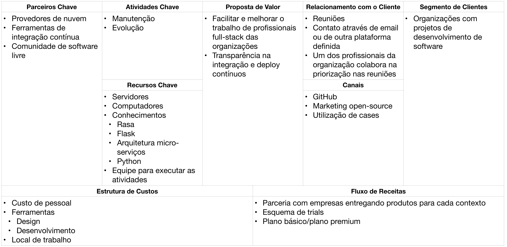

# Business Model Canvas

| **Data** | **Versão** | **Descrição** | **Autor** |
| --- | --- | --- | --- |
| 27/03/2019 | 0.1 | Cronstrução da versão inicial | Ateldy Brasil, Bruno Oliveira, João Vitor Ramos, Vítor Gomes |
| 28/03/2019 | 1.0 | Construção de versão após feedback | Vítor Gomes |
| 29/03/2019 | 1.1 | Adição de link para imagem de maior tamanho | João Vitor |

## Modelo de Negócios v1.0

[Clique aqui para visualizar a imagem em um maior tamanho](https://raw.githubusercontent.com/fga-eps-mds/2019.1-Grupo-3/20-ElaborarCanvas/docs/img/canvas/canvas_v1.png)

## Modelo de Negócios v0.1

[Clique aqui para visualizar a imagem em um maior tamanho](https://raw.githubusercontent.com/fga-eps-mds/2019.1-Grupo-3/20-ElaborarCanvas/docs/img/canvas/canvas_v0_1.jpeg)
