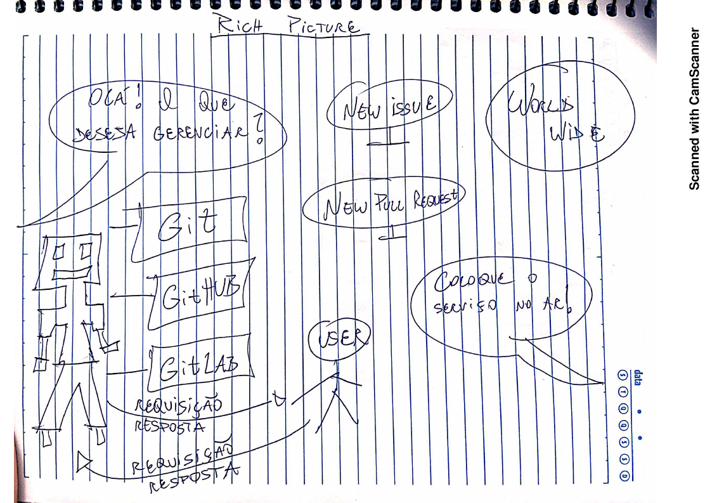

## Rich Pictures

&emsp;&emsp;Rich Picture trata-se de uma forma de modelagem de ideias, pouco formal, e
ideal para reuniões com clientes e/ou em times de desenvolvimento. Além disso, ela se baseia em rascunhar desenhos e usar textos curtos e objetivos
para expressar um momento, um desejo, uma atividade, dentre
outras necessidades.
Os desenhos podem ser feitos à mão livre ou via um software.
Idealmente, são feitos, no momento da reunião, à mão livre.
Essa técnica de anotação é prática, útil, e facilita registrar momentos
e impressões junto aos interessados.
Isso contribui para com o levantamento dos requisitos, uma das
  primeiras atividades da Engenharia de Requisitos. As Rich Pictures foram realizadas na intenção de melhorar e dar uma visão mais abrangente sobre o escopo do projeto entre os integrantes do grupo, trazendo uma definição mais concreta do produto.

#### Autor: Caio Vinicius 

#### Autor: Erick Giffoni

#### Autor: Guilherme Mendes 

#### Autor: João Pedro

#### Autor: Lucas Fellipe

