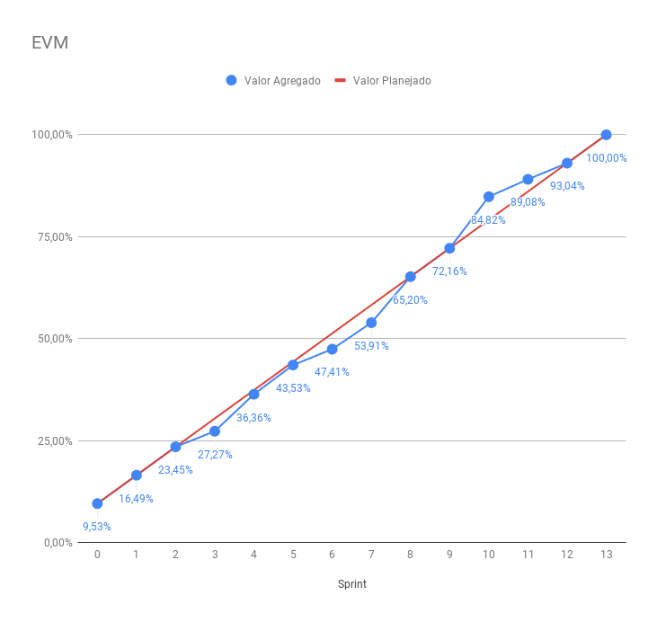
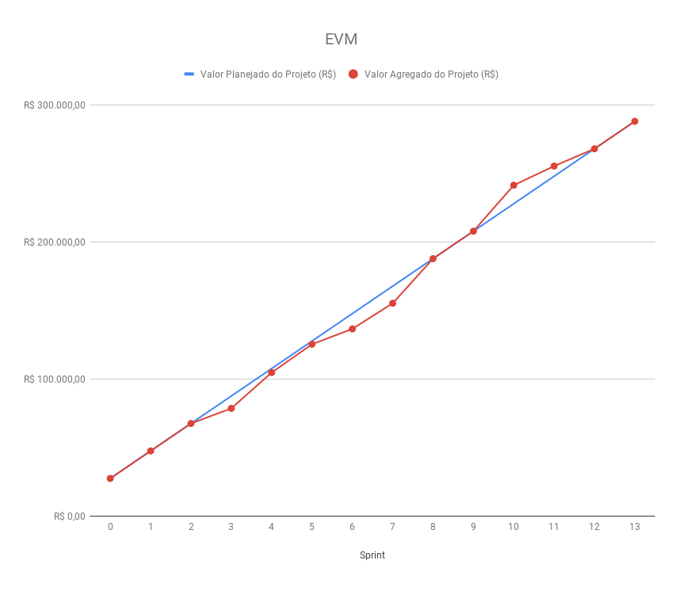

# Agile Earned Value Management

| **Data** | **Versão** | **Descrição** | **Autor** |
| --- | --- | --- | --- |
| 22/06/2019 | 1.0 | Construção do documento | Vítor Gomes |

## 1. Earned Value Management (EVM)

A EVM é uma ferramenta muito utilizada no mercado para monitoramento de performance e gerenciamento de projetos. De maneira simplificada, ela é útil para mostrar tanto aos gerentes quanto ao cliente o estado de valor do projeto frente àquilo que já foi gasto e planejado. Ela apresenta, além disso, uma curva que permite a análise do histórico do projeto, permitindo supor e planejar-se melhor para as seguintes etapas do projeto.

A análise do histórico e das tendências a partir da EVM também serve como uma ferramenta importante para a negociação entre gerentes e clientes sobre prazos e orçamento.

## 2. Adaptações para o contexto da Ada

- Exclusão da curva de Custos, já que não há dispêndio de custos de fato
- Ao apresentar a EVM para o time, não se utiliza os acrônimos tradicionais, referindo-se apenas pela cor, a fim de facilitar a comunicação (RUSK, 2009);
- Devido à natureza da metodologia ágil, assume-se um crescimento linear ao longo do tempo para a curva de Valor Planejado (RUSK, 2009);
- Não se utilizam pontos para computador valor na EVM. No nosso caso, o PO, ao final de cada Sprint, analisa as issues entregues e não entregues frente ao planejamento do projeto e a partir disso avalia o Valor Agregado para aquela Sprint. Tomamos isso como base para evitar as complicações e irregularidades apresentadas ao se utilizar os pontos de história nesse sentido e pelo PO, sendo representante do cliente dentro do projeto, possuir o maior entendimento sobre as necessidades e valores do cliente;
- São utilizadas duas versões da EVM: uma mais simples que utiliza apenas porcentagens, para discussão com o time, e outra com valores monetários, para melhor compreensão do cliente.

## 3. EVM final

### 3.1 EVM simplificada

### 3.2 EVM

## 4. Referências

Rusk, J. (2009). Earned Value for Agile Development. Software Tech News, 12(1), 20-27.

Efe, P., & Demirörs, O. (2013, September). Applying EVM in a software company: benefits and difficulties. In 2013 39th Euromicro Conference on Software Engineering and Advanced Applications (pp. 333-340). IEEE.
