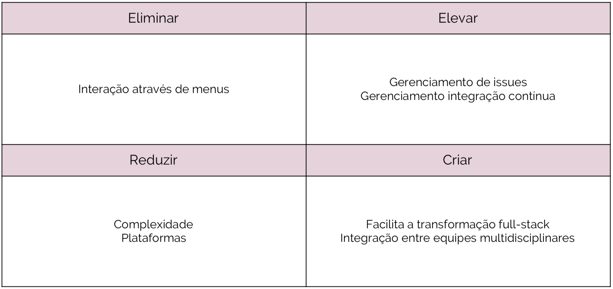
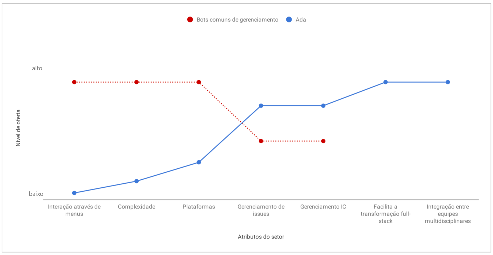
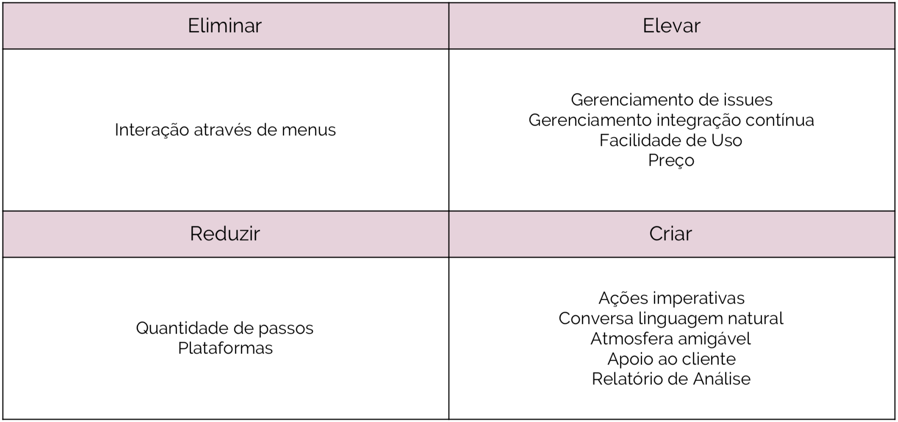

# Estratégia do Oceano Azul

| **Data** | **Versão** | **Descrição** | **Autor** |
| --- | --- | --- | --- |
| 17/04/2019 | 1.0 | Construção do documento | Vítor Gomes |

## Estratégia e Matriz de Avaliação de Valor
A Matriz de Avaliação de Valor é uma prática proposta pela estratégia do oceano azul a fim de analisar os setores, analisando oceanos vermelhos e servindo como base para a criação da estratégia do oceano azul.
Oceanos vermelhos representam setores existentes hoje, enquanto oceanos azuis simbolizam espaços de mercado inexplorados, caracterizados pela criação de demanda e pelo crescimento altamente lucrativo.

### Matriz Eliminar Reduzir Elevar Criar v1.0

Guiados pelo livro desta estratégia, analisamos o contexto dos setores do mercado atual, identificando atributos e fatores de concorrência. Em seguida, foram identificados alguns aspectos:
* Atributos anteriormente considerados indispensáveis pelo setor que podem ser eliminados
* Atributos que podem ser reduzidos bem abaixo dos padrões setoriais
* Atributos que devem ser elevados acima dos padrões setoriais
* Atributos nunca oferecidos pelo setor que devem ser criados

A partir disso, pudemos montar nossa Matriz Eliminar-Reduzir-Elevar-Criar, mostrada abaixo.

### Matriz de Avaliação de Valor v1.0
Subsequentemente, plotou-se a Matriz de Avaliação de Valor da Ada, comparada aos oceanos vermelhos do mercado.

Diminuindo a complexidade e aprimorando funcionalidades, facilita-se a transformação full-stack de funcionários das organizações e a integração entre equipes multidisciplinares no contexto de cada empresa.

[Clique aqui para visualizar a imagem em um maior tamanho](https://raw.githubusercontent.com/fga-eps-mds/2019.1-ADA/gh-pages/docs/assets/img/product/blue_ocean_strategy/strategy_canvas_v1.png)

## Livro Oceano Azul
A seguir apresentamos também pontos relevantes encontrados no livro da estratégia do oceano azul após sua leitura.

- Oceanos vermelhos representam setores existentes hoje, enquanto oceanos azuis simbolizam espaços de mercado inexplorados, caracterizados pela criação de demanda e pelo crescimento altamente lucrativo
- A maioria dos oceanos azuis se desenvolve dentro dos oceanos vermelhos, expandindo fronteiras setoriais
- A competição em oceanos azuis é irrelevante
- Uma boa estratégia se caracteriza pelo foco, singularidade e mensagem consistente
- A fim de promover a inovação de valor, a empresa deve decidir quais atributos do setor deve eliminar e reduzir, em vez de apenas criar e elevar atributos, a fim de criar uma nova curva de valor singular
- Deve-se analisar a estratégia para evitar contradições estratégicas (e.g. melhorar a facilidade de uso de um site, mas ainda mantê-lo lento)
- Os atributos da estratégia geralmente devem estar expressos em termos que os compradores possam compreender e valorizar
- O livro apresenta uma série de fronteiras para construir sua estratégia: 1. examinar setores alternativos, identificando os principais atributos que levam os clientes a optar entre alternativas; 2. examinar grupos estratégicos do setor, geralmente divididos em preço e desempenho; 3. examinar a cadeia de compradores, analisando compradores, influenciadores e usuário final, que podem não ser a mesma entidade; 4. examinar ofertas de produtos e serviços complementares; 5. examinar apelos funcionais e emocionais dos compradores, geralmente o apelo comum é resultado da maneira como as empresas competiam no passado, o que inconscientemente moldou as expectativas dos consumidores; 6. examinar o transcurso do tempo, observando tendências do mercado e suas possíveis transformações no setor
- Também é interessante em alguns casos analisar os três níveis de não clientes: não clientes "quase convertidos", na fronteira do setor e prontos para embarcar; não clientes "refratários", que conscientemente optaram contra o setor; e não clientes "inexplorados", que estão em setores distantes
- O livro propõe uma sequência estratégica para elaborar a estratégia do oceano azul: analisar a utilidade para o comprador (Sua ideia de negócios gera utilidade excepcional para o comprador?), preço (O seu preço é facilmente acessível para a massa de compradores?), custo (Você é capaz de cumprir sua meta de custo para lucrar ao preço estratégico?) e adoção (Quais são as barreiras na adoção para que você realize sua ideia de negócios? Você as está encarando?). Após responder essas perguntas ter-se-á uma estratégia do oceano azul comercialmente viável
- Os autores apresentam ainda um corredor de preço de massa, a fim de auxiliar gestores a determinar o preço de uma oferta irresistível. Isso envolve identificar outros produtos com forma diferente e mesma função e forma e função diferentes mas mesmo objetivo e então especificar um nível dentro do corredor de preço
- Ainda, para atingir a meta de custo, as empresas dispõem de três importantes alavancas: 1. dinamizar operações e implementar inovações de custo, desde a fabricação até a distribuição; eliminar, reduzir ou terceirizar atividades de alto custo e baixo valor agregado na cadeia de valor, dentro do possível; reduzir quantidade de componentes do produto ou serviço e número de estágios do processo de produção, dentro do possível; 2. parcerias; 3. mudar o modelo de precificação do setor
- Finalmente, para evitar a armadilha da concorrência, a empresa precisa monitorar as curvas de valor. Esse monitoramento sinaliza quando inovar valor e quando se deve persistir na estratégia vigente. Quando a curva de valor começa a convergir com as dos concorrentes, chegou a hora de desbravar novo oceano azul

## Versões anteriores das matrizes

### Matriz Eliminar Reduzir Elevar Criar v0.1

### Matriz de Avaliação de Valor v0.1

[Clique aqui para visualizar a imagem em um maior tamanho](https://raw.githubusercontent.com/fga-eps-mds/2019.1-ADA/gh-pages/docs/assets/img/product/blue_ocean_strategy/strategy_canvas_v0_1.png)
