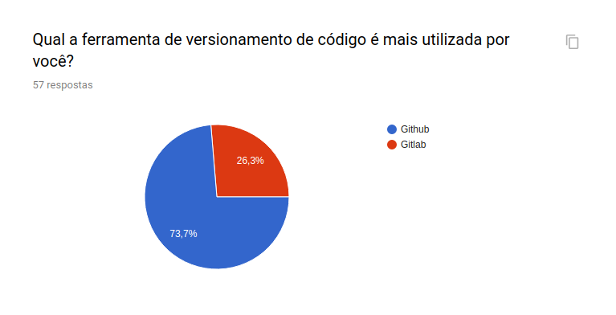
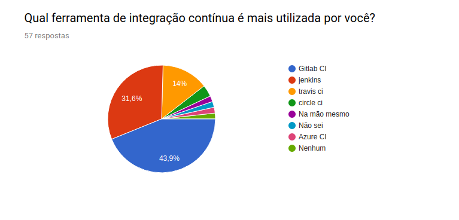

# Questionário

| Data       | Versão | Descrição            | Autor             |
|:----------:|:------:|:--------------------:|:-----------------:|
| 03/04/2019 | 1.0 | Criação do documento e análise do questionário | Bruno Dantas|

&emsp;&emsp;O questionário tem como propósito definirmos qual pipeline a ADA poderá monitorar e gerenciar. O mesmo recolheu um total de 57 respostas onde desenvolvedores e estudantes de softwares escolheram suas preferências de ferramentas para hospedagem de projeto, integração continua e deploy. Abaixo esta o resultado da pesquisa. 

## 1. Ferramenta para comunicação profissional

>Esse tópico tem como objetivo sabermos onde a Ada terá contato com o usuário, como pode ser percebido, a ferramenta de comunicação mais utilizada é o Whats'app. Porém, como o Whats'app não disponibiliza a Api, o grupo optou por utilizar a segunda opção o Telegram. Dessa forma, a Ada gerenciará a aplicação do a partir do Telegram.

## 2. Plataforma de hospedagem de códigos

>Para o versionamento do projeto a preferência da plataforma foi o Github. A Api dessa plataforma é aberta então não teremos problemas para extrair informações.

## 3. Ferramenta para Integração Contínua

>A ferramenta mais votada para a Integração Contínua foi o Gitlab CI, visto que ela está sempre em evolução e apresentar ser bastante completa nesse meio.

## 4. Ferramenta para Deploy

>Para esse tópico escolhemos a Amazon como ferramneta de deploy, apesar do Heroku ter ficado como preferência. Isso ocorreu pois grande parte do público, que respondeu o questionário são estudantes, e o Heroku é mais usado para fins didáticos. Já a Amazon é utilizada por grandes empressas.