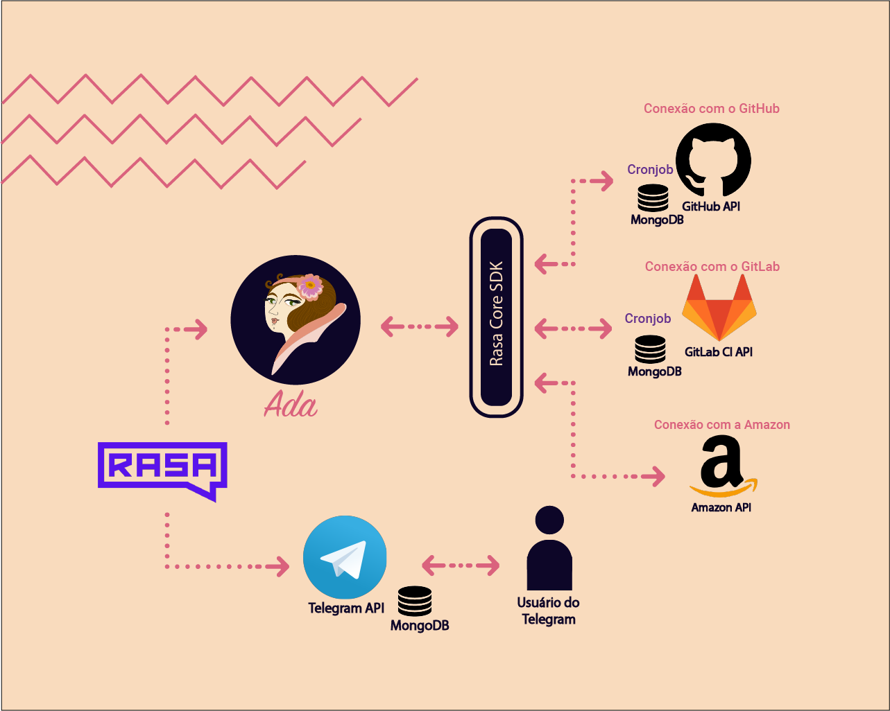
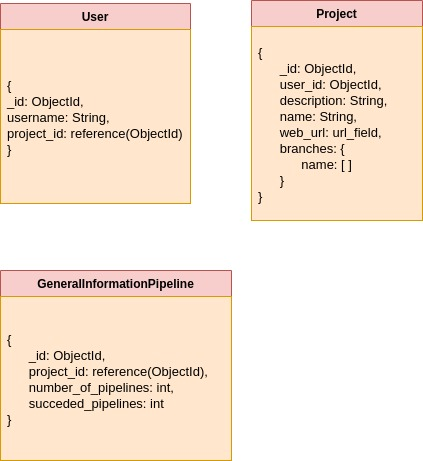
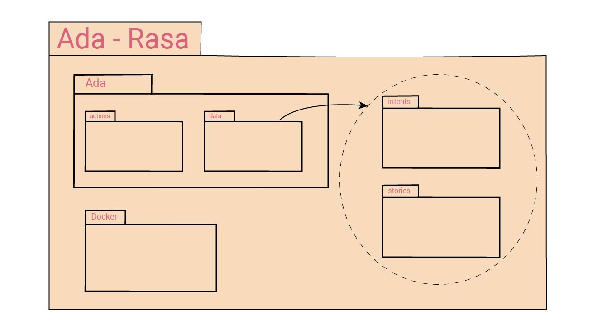
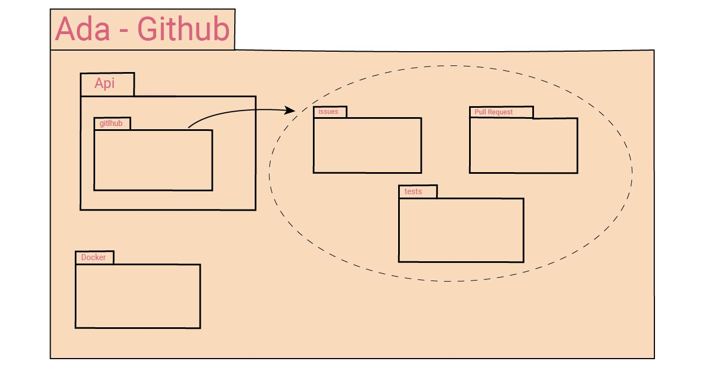
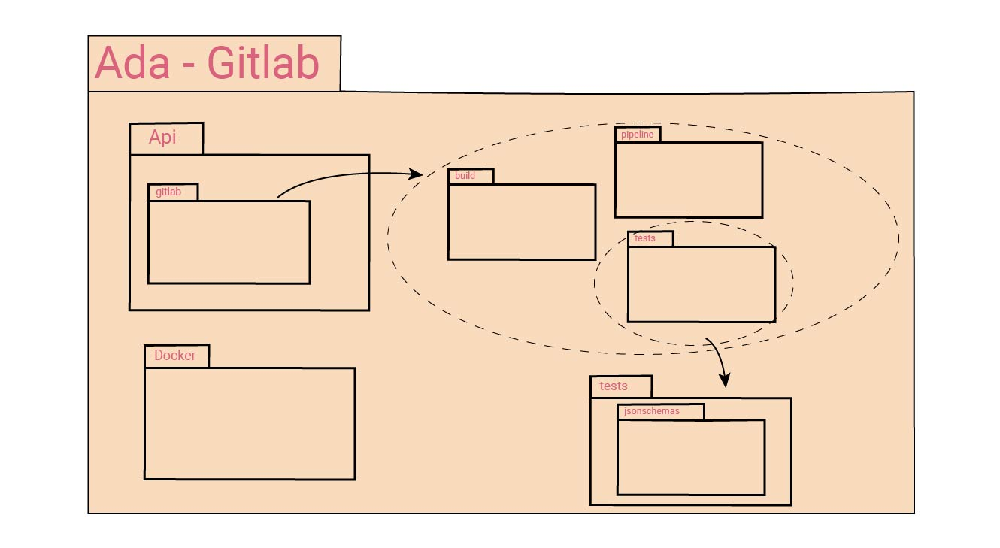

# Documento de Arquitetura

| **Data** | **Versão** | **Descrição** | **Autor** |
| --- | --- | --- | --- |
| 24/03/2019 | 0.1 | Abertura do documento | Erick Giffoni |
| 25/03/2019 | 0.2 | Criação e escrita do tópico 1.1 | João Pedro José |
| 28/03/2019 | 0.3 | Complementação do subtópico 1.2 - Escopo; adição dos subtópicos 2.2.1, 2.2.2, 2.2.3, 2.2.4 e 2.2.5 - GitHub API, Integração contínua, Deploy, Rasa e Telegram API, respectivamente; Adição de mais algumas referências; Complementação dos subtópicos 2.2.1, 2.2.4 e 2.2.5; Adição e complementação dos subtópicos 3.1 e 3.2 - Metas do _software_ ADA e Restrições da Arquitetura, respectivamente. | Erick Giffoni |
| 28/03/2019 | 0.4 | Adição do subtópico 2.2.6 | Guilherme Mendes |
| 29/03/2019 | 0.5 | Complementação do subtópico 2.1 - Diagrama de relações - com a adição de um breve texto explicativo. | Erick Giffoni |
| 29/03/2019 | 0.6 | Complementação do tópico 2 - Representação da arquitetura; Adição do Diagrama de Relações (Imagem ilustrativa) no subtópico 2.1. | Guilherme Mendes |
| 29/03/2019 | 0.7 | Complementação dos subtópicos: 2.2.1, 2.2.2, 2.2.3 e 2.2.5 e adição de referências. | Caio Fernandes |
| 29/03/2019 | 0.8 | Adição do subtópico 5.1 - Diagrama de Pacotes. | João Pedro José |
| 29/03/2019 | 0.9 | Adição do tópico 4 - Visão de casos de uso; Complementação dos subtópicos 2.2 - Tecnologias. | Guilherme Mendes |
| 29/03/2019 | 0.9.1 | Complementação do subtópico 3.2 - Restrições da arquitetura; Complementação do subtópico 2.2.6.. | Lucas Fellipe |
| 29/03/2019 | 1.0 | Adição do subtópico 5.2 - Diagrama de Classes. | João Pedro José |

## 1. Introdução

### 1.1 Finalidade

&emsp;&emsp;Esse documento de arquitetura têm como função apresentar uma visão sobre a arquitetura utilizada pelo software ADA e mostrar como são feitas as conexões entre os elementos utilizados para que o ChatOps funcione. A comunicação dele com o Telegram e com repositórios Git, além de outros elementos utilizados para o bom funcionamento do software, como containers e banco de dados, são alguns destes elementos. 

### 1.2 Escopo

&emsp;&emsp;ADA é um ChatOps cuja finalidade principal é controlar repositórios remotos de maneira automatizada e simples, auxiliando assim a integração de equipes de desenvolvedores de modo a otimizar o desenvolvimento de software. 

&emsp;&emsp;A partir disso, são apresentadas as estruturas necessárias para o funcionamento da ADA e a devida arquitetura desse software, nesse documento. Tem-se, primeiramente, uma representação arquitetônica geral da ADA, depois uma explicação sobre as metas e as restrições dessa arquitetura. Após isso, apresenta-se a visão de casos de uso e, em seguida, a visão lógica. 

### 1.3 Referências

- Como documentar a arquitetura de um software. http://www.linhadecodigo.com.br/artigo/3343/como-documentar-a-arquitetura-de-software.aspx . Acesso em 24/03/2019 - 16:40h;

- Documento de arquitetura SIGS. https://github.com/fga-eps-mds/2017.1-SIGS/wiki/Documento-de-Arquitetura. Acesso em 24/03/2019 - 16:45h;

- Documento de arquitetura Dulce. https://dulce-work-schedule.github.io/especificacao/arquitetura.html. Acesso em 24/03/2019 - 16:50h;

- Documento de arquitetura C-Registration System. http://mds.cultura.gov.br/extend.formal_resources/guidances/examples/resources/sadoc_v1.htm. Acesso em 24/03/2019 - 17h;

- Documento de arquitetura Lino. https://botlino.github.io/docs/doc-arquitetura . Acesso em 28/03/2019 - 13:55h;

- The Rasa Stack. https://rasa.com/ . Acesso em 28/03/2019 - 14:45h;

- GitHub API. https://developer.github.com/v3/. Acesso em 29/03/2019 - 10:14h;

- Telegram API: https://core.telegram.org. Acesso em 29/03/2019 - 10:36h.

## 2. Representação da arquitetura

### 2.1 Diagrama de relações

O software ADA funciona com base na seguinte representação arquitetural: 

Imagem 1 - Representação Arquitetural

&emsp;&emsp; O projeto é modelado em arquitetura de microsserviços, que visa implementar pequenos serviços independetes e modularizados. Cada serviço tem uma funcionalidade única e está hospedado em seu próprio repositório, o que deixa ainda mais acentuada a utilização do microsserviço. Além disso, cada serviço possuí seu próprio ambiente de padronização, integração contínua e tecnologias. Os serviços utilizados no projeto são totalizados em 3, sendo eles: 

* Ada
* ADA - Conexão com GitHub
* ADA - Conexão com GitLab

&emsp;&emsp; Nota-se que a Conexão com a Amazon não é um microsserviço, pois é necessario apenas uma requisição para a API externa da Amazon, para pegar dados do deploy da aplicação do usuário.
 

&emsp;&emsp; No centro do diagrama acima encontra-se a ADA. Ela é responsável por, via Rasa, interpretar diferentes mensagens e gerar respostas, as quais são passadas ao usuário via Telegram, assim estabelecendo uma comunicação ativa, rápida, simples e eficiente. O Rasa é dividido em duas partes de extrema importante o Rasa Nlu e o Rasa Core. O Rasa Nlu é responsável pelo processamento de linguagem natural, já o Rasa Core encarregado do machine learning, no qual é possível treinar as conversar do bot.
 

Encontra-se a escolha do pipeline do Nlu para o projeto:

* [Nlu](/docs/project/machine_learning_pipeline.md) 

&emsp;&emsp; Como dito anteriormente, os serviços possuem funcionalidades específicas. No qual cada serviço possuí sua própria API interna, mas além delas ainda é necessário utilizar API's externas, sendo elas:

<b> Serviços internos: </b>

* Ada;
* Conexão com Github;
* Conexão com Gitlab;

<b> Serviços externos: </b>

* API do Telegram;
* API do Github;
* API do Gitlab;
* API da Amazon;

&emsp;&emsp; É importante ressaltar que os usuários que utilizarão a Ada deverão ter necessariamente as tecnologias que definimos previamente, Github, Gitlab e Amazon. Como plano básico, previsto no modelo de negócios.

Para mais informação consulte o modelo de negócios:

[Modelo de Negócios](/docs/product/canvas.md)

### 2.2 Representação dos Microserviços

#### 2.2.1 ADA

A ADA é o serviço responsável pela comunicação entre o usuário e o chatbot, através do Rasa. Ele reconhece as intenções que usuário deseja, as trata e retorna com uma resposta adequada para o mesmo. É aqui o onde as "conversas" são treinadas pelo Rasa e para que possa compreender e responder o interessado de uma forma mais natural.

#### 2.2.2 ADA - Conexão com GitHub

O microsserviço da conexão com Github é responsável por monitorar e gerenciar issues, commits e pull requests que são informações a respeito do versionamento e gerenciamento do projeto do repositório do usuário, além de gerar relatórios detalhados contendo mais informações. Para que isso acontece o serviço acessa a API externa do Github através de requisições e guarda e trata os dados na API feita em MongoDB do próprio serviço, e retorna os dados para o usuário usando o Rasa como ponte. Além disso é possivel também fazer agendamentos de relatórios usando o Cronjob, que é um script no qual está sempre rodando, ele executa tarefas de forma automatica em determinados intervalos, na ADA ele será responsável por enviar os relatórios agendados pelo usuário.

#### 2.2.3 ADA - Conexão com GitLab

O microsserviço Conexão com GitLab é responsável por monitorar e gerenciar pipelines, jobs e builds que são informações a respeito da integração contínua do repositório do usuário, além de gerar relatórios detalhados contendo mais informações. Para que isso acontece o serviço acessa a API externa do Gitlab através de requisições e guarda e trata os dados na API feita em MongoDB do próprio serviço, e retorna os dados para o usuário usando o Rasa como ponte. Além disso é possivel também fazer agendamentos de relatórios usando o Cronjob, como visto anteriormente no tópico acima. Ainda é possível visualizar a modelagem feita no banco de dados desse microsserviço, logo abaixo.

### 2.3 Tecnologias

#### GitHub API

&emsp;&emsp;Rest API disponibilizada pelo GitHub para que utilizemos seus recursos. Assim, o papel da GitHub API é dar suporte à ADA, providenciando as informações que o Software requerer de forma rápida, dessa forma garantindo a automatização e o gerenciamento das tarefas relacionadas ao desenvolvimento de um software. 

#### GitLab CI

&emsp;&emsp;A integração contínua é uma prática de desenvolvimento de software de DevOps em que os desenvolvedores, com frequência, juntam suas alterações de código em um repositório central. Depois disso, criações e testes são executados.

&emsp;&emsp;Com a ADA, desenvolvedores recebem feedback do resultado dos testes da Integração Contínua e, de acordo com esse resultados, podem tomar decisões e novamente utilizar a ADA para monitorá-las.

#### Amazon

&emsp;&emsp;Com o Deploy contínuo, as alterações de código são criadas, testadas e preparadas automaticamente para que a produção seja liberada. O deploy contínuo expande com base na integração contínua ao implantar todas as alterações de código em um ambiente de teste e/ou ambiente de produção, após o estágio de criação.

&emsp;&emsp;Utilizando a ADA, pode-se configurar o deploy da sua aplicação e torná-lo automatizado, assim como receber informações de desempenho da atual versão do software em produção. 

#### Rasa

&emsp;&emsp;Rasa Stack é um conjunto de ferramentas de machine learning (aprendizado de máquina) voltado para desenvolvedores criarem chatbots e assistentes contextuais baseados em mensagens de voz e de texto. Essa tecnologia é open source (código livre) e utiliza processamento de linguagem natural para criar diálogos que vão além de simples perguntas.

&emsp;&emsp;Dessa forma, o Rasa atua de forma a processar as mensagens enviadas pelo(s) usuário(s) e comunicar essas informações aos algoritmos da ADA. Assim, nosso software sustenta as devidas providências para atender ao(s) pedido(s) do(s) usuário(s). Esse processo é uma via de mão dupla: primeiro, a informação é passada do Rasa para a ADA; depois, a resposta é enviada da ADA para o Rasa, e assim, atinge-se o usuário na plataforma Telegram.

#### Telegram API

&emsp;&emsp;Esta API permite a conexão de Bots com o Telegram, ela traz várias soluções prontas para que o usuário interaja com o bot, tais como: interações "por linha", uma plataforma de pagamentos embutida, plataforma de jogos,  teclados customizáveis e comandos customizáveis para o usuário.

&emsp;&emsp;Logo, a função dessa ferramenta é fundamental para o correto funcionamento da ADA. Telegram Bot API é responsável por permitir uma interface amigável para que ADA interaja com o usuário de maneira usual, utilizando a forma de mensagens escritas em linguagem natural na língua portuguesa. 

#### Flask

&emsp;&emsp;O Flask é um micro-framework para Python baseado em Werkzeug, Jinja 2 e good intentions. Ao contrário de outros web frameworks, o Flask não tem uma camada adicional de acesso ao banco de dados, com isso, a integração com toolkits de banco de dados facilita o seu uso. 

&emsp;&emsp;Essa arquitetura será utilizada para a construção da API, que vai ser um dos pontos principais do nosso projeto. Através das APIs, os aplicativos podem se comunicar uns com os outros sem conhecimento ou intervenção dos usuários. Elas funcionam através da comunicação de diversos códigos, definindo comportamentos específicos de determinado objeto em uma interface. 

#### Microsserviços

&emsp;&emsp;O estilo de arquitetura de microsserviços é uma abordagem que desenvolve um aplicativo único como uma suíte de pequenos serviços, cada um executando seu próprio processo e se comunicando através de mecanismos leves, muitas vezes em uma API com recursos HTTP. 

&emsp;&emsp;No projeto ADA, essa arquitetura é utilizada com o intuito de modularizar todo o software, fazendo com que cada elemento da funcionalidade funcione em serviços diferentes, isso faz com que tanto o deploy como a manutenção do bot sejam mais fáceis e eficientes. 

#### MongoDB

&emsp;&emsp; A tecnologia MongoDB é um banco de dados open-source orientado a documentos. Classificado como NoSQL, a tecnologia utiliza documentos com padrão JSON.

&emsp;&emsp; Esta tecnologia se comunicará com o projeto de maneira que receberá os dados fornecidos pelas conversas e interações realizadas no ChatBot e as armazenará em um banco de dados, para posteriormente serem usadas na criação de relatórios da utilização do ChatBot.

## 3. Metas e restrições da arquitetura

### 3.1 Metas do software ADA

Com a visão de controlar repositórios remotos, ADA:
- Melhora a integração de times de desenvolvedores com a ferramenta git;
- Automatiza processos de desenvolvimento de software;
- Traz informações relevantes ao usuário sobre diversas etapas daqueles processos;
- Posiciona-se como um software amigável, auxiliador e prático para com o usuário;
- Diminui consideravelmente o acúmulo de processos e de informações sobre o andamento do desenvolvimento de um software;

### 3.2 Restrições da arquitetura

As restrições de arquitetura são:
- Ter acesso à internet;
- Possuir o aplicativo Telegram;
- Acesso a conta de alguma ferramenta gerenciadora de repositório de software baseada em git;
- Controle de apenas 1 repositório por chat;
- Compreender significamente o português.
- Utilização de um banco de dados chamado MongoDB;

## 4 Visão Lógica

### 4.1 Diagrama de Pacotes

Imagem 01 - Diagrama de pacotes do Microsserviço do Bot ADA.

Imagem 02 - Diagrama de pacotes do Microsserviço Conexão com o GitHub.

Imagem 03 - Diagrama de pacotes do Microsserviço Conexão com o GitLab.

Imagem 04 - Diagrama de pacotes geral dos Microsserviços .