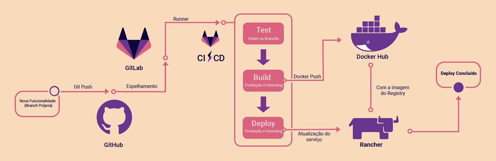

# Gitflow

| Data | Versão | Descrição | Autor |
|:----:|:------:|:---------:|:-----:|
|28/03/2019|1.0|Criação da versão inicial do gitflow | João Vitor |
|26/04/2019|2.0|Atualização do documento com todas tecnologias utilizadas | João Vitor, Bruno Dantas |

## 1. Visão Geral

Foi idealizado um _Gitflow_ (fluxo de trabalho) automatizado visando entregas de funcionalidade mais rápidas e de mais qualidade.

O fluxo de trabalho contará com 3 estágios de verificação até o envio do serviço para o ambiente de produção. Os estágios de **teste**, **build** e **deploy**.

As ferramentas selecionadas para o auxílio de entrega contínua foram:
- Docker
- DockerHub
- GitHub
- Gitlab-CI
- Rancher 1.6

[Clique aqui para visualizar a imagem em um maior tamanho](https://raw.githubusercontent.com/fga-eps-mds/2019.1-ADA/AtualizaGitFlow/docs/assets/img/project/gitflow/gitflow.jpg)

## 2. Workflow

Quando iniciado o desenvolvimento de uma funcionalidade deve-se primeiro iniciar o docker. E depois do ambiente rodando corretamente, deve-se criar uma _branch_ seguindo a [política de branches](/docs/policies/branches.md).

Após a criação da _branch_, os _commits_ devem ser feitos de acordo com a [política de commits](/docs/policies/commits.md). Ao realizar o _push_ de um _commit_ para a sua _branch_ correspondente no [repositório do projeto](https://github.com/fga-eps-mds/2019.1-Grupo-3), irá ser utilizada a ferramenta de continuous integration, gitlabCI por meio de um espelhamento das contribuições para o gitlab. Nesse momento é testado o primeiro estágio do _deploy_, descrito pela ferramenta do gitlab chamado gitlabCI, _test_.

Após a finalização da funcionalidade, um Pull Request deve ser aberto, de acordo com a [política de Pull Requests](/docs/policies/pull_request.md), da _branch_ em que se foi feito o trabalho para a branch de homologação, devel. **Importante** - Um _Pull Request_ só será aceito caso o estágio de _teste_ estiver passado pelo gitlabCI.

Ao _Pull Request_ ser aceito para a branch de homologação, ele passa por todos os estágios(teste, build e deploy) e se todos esses estiverem funcionando corretamente, passa pelo estágio de _deploy_ para o ambiente de homologação.

Após a realização dos testes em ambiente de homologação na _branch_ devel e a validação de um usuário real, é aberto um _pull request_ para a branch master.

A _branch_ master é o ambiente de produção. Local em que todas alterações devem estar funcionando corretamente. Porém caso ocorra algo que não foi localizado em alguma das etapas anteriores, todos os estágios de _teste_, _build_ e _deploy_ são rodados novamente.

## 3. Tecnologias

### Docker
  O docker terá duas funcionalidades principais: padronização e isolamento do ambiente.

  Para a padronização do ambiente de desenvolvimento, servirá para o ambiente ser exatamente o mesmo independentemente de Sistema Operacional(SO), visto que dentro da equipe existe uma grande diversidade desses. Mitigando o risco de erros não previstos por conta dessa diferença de SO's.
  Além disso o docker foi utilizado para o envio de imagens para o registry utilizado, no caso o DockerHub.

### DockerHub
  O DockerHub é uma ferramenta que servirá como _registry_. O que é basicamente um repositório de imagens de Docker.

  Ao decorrer do projeto serão geradas imagens de docker e essas serão enviadas ao repositório no DockerHub. Sendo facilmente utilizadas por todos os serviços do produto.

  As imagens possuirão as tags de acordo com o seu ambiente. Por exemplo: uma imagem que pertence ao ambiente de homologação terá a tag _homolog_, uma imagem que pertence ao ambiente de produção possuirá a tag _prod_, e assim sucessivamente.

### Github
  É uma ferramenta de controle de versão adotada mundialmente. Através dela é possível que diversas pessoas possam contribuir simultaneamente no mesmo projeto.

  Assim, fizemos o versionamento do código será realizado via Github e adaptado de acordo com os padrões de Software Livre.

### Gitlab-CI
  O gitlab será utilizado para a automatização do _pipeline_ de entrega contínua das funcionalidades a serem desenvolvidas.

  Como o código está hospedado no github foi necessário realizar um espelhamento do repositório para o gitlab, assim toda a configuração de integração e deploy contínuos se torna possível.

  Foram definidos três estágios no pipeline: **test**, **build** e **deploy**. A configuração desses estágios é realizada através de um arquivo YML chamado gitlab-ci.yml, localizado na raíz do projeto.

### Rancher 1.6
  O rancher 1.6 é uma ferramenta que serve como uma interface gráfica para orquestradores de containers Cattle e Kubernetes, com ele podemos gerenciar todos os nossos serviços em apenas um local. Podendo elaborar diversos ambientes de desenvolvimento como produção, homologação e teste.
  Além da facilidade de possuir uma interface gráfica, o rancher facilita a utilização de ferramentas para geração de certificados como o Let's Encrypt.

## Estágio de teste
  Esse estágio ocorre em todas as branches do projeto. Apesar disso, os testes não são os mesmos para todos os serviços, visto que cada serviço possui os testes configurados de acordo com seu contexto.
  É o primeiro estágio de todos, sendo assim caso algum critério definido não seja alcançado os próximos passos não serão executados. Facilitando a verificação de erros de síntaxe.  
  Todos os testes devem estar corretamente implementados para a branch da funcionalidade a ser integrada para a branch devel, caso contrário serão solicitadas modificações no código para devida implementação desses.
  Os testes utilizados nesse estágio são:
  Unitários: Método utilizado para teste de métodos, classes, funcionalidades e módulos. Os critérios de aceitação para esses são definidos pelo _DevOps_ e _Product Owner_.
  Estáticos: Método utilizado para verificação de síntaxe de código, analisando se o código segue a folha de estilo definida pela linguagem. No caso o PEP8, padrão do python.

## Estágio de build
  Estágio em que o docker é utilizado para o envio de imagens dos serviços para o DockerHub. Esse estágio é utilizado somente nas branches de homologação(_devel_) e produção(_master_). As imagens disponíveis no DockerHub são geradas nessas duas branches, a branch _master_ gera uma imagem com a tag _prod_ e a branch devel gera uma imagem com tag _homolog_.

## Estágio de deploy
  Após a execução correta de todos os estágios anteriores, esse estágio será executado. Nele o deploy dos ambientes de homologação e produção são realizados. Utilizando o Rancher para a realização de tal, definindo as _Stacks_, _Environment_ e serviços a serem atualizados.
