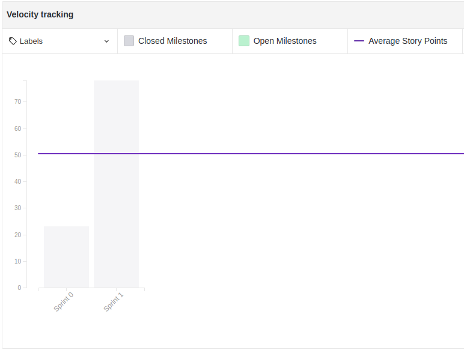
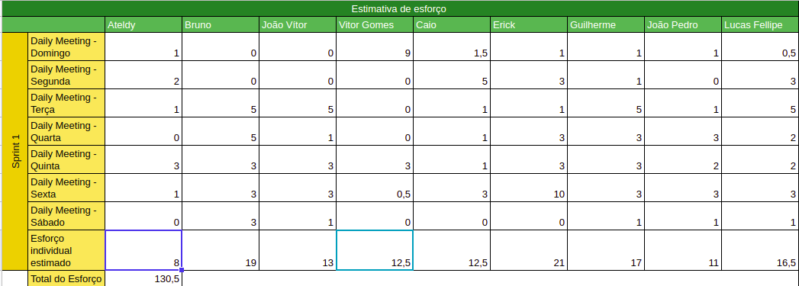

# Resultados Sprint 1

A Sprint 1 obteve êxito na propósito de treinamento e documentação. Todas as tarefas planejadas foram concluídas.

## Fechamento da Sprint

| Issue | Pontos | Status |
| ----- | ------ | ------ |
| [Escolher uma licença para o nosso software (MDS)](https://github.com/fga-eps-mds/2019.1-Grupo-3/issues/18) | 1 | Concluído |
| [Refatorar Documento de Visão (MDS)](https://github.com/fga-eps-mds/2019.1-Grupo-3/issues/16) | 3 | Concluído |
| [Definir a personalidade e o nome do nosso ChatOps (MDS)](https://github.com/fga-eps-mds/2019.1-Grupo-3/issues/17) | 3 | Concluído |
| [Elaborar o documento de arquitetura de software (MDS)](https://github.com/fga-eps-mds/2019.1-Grupo-3/issues/15) | 13 | Concluído |
| [Elaboração de Rich Pictures (MDS)](https://github.com/fga-eps-mds/2019.1-Grupo-3/issues/19) | 2 | Concluído |
| [Treinamento de Python (MDS)](https://github.com/fga-eps-mds/2019.1-Grupo-3/issues/10) | 13 | Concluído |
| [Criação do Guia de Contribuição (EPS)](https://github.com/fga-eps-mds/2019.1-Grupo-3/issues/13) | 3 | Concluído |
| [Definir Plano de Negócios (EPS)](https://github.com/fga-eps-mds/2019.1-Grupo-3/issues/20) | 5 | Concluído |
| [Criar documento de Gitflow (EPS)](https://github.com/fga-eps-mds/2019.1-Grupo-3/issues/21) | 5 | Concluído |
| [Elaborar a Estrutura Analítica de Projeto (EPS)](https://github.com/fga-eps-mds/2019.1-Grupo-3/issues/22) | 5 | Concluído |
| [Elaborar README (EPS)](https://github.com/fga-eps-mds/2019.1-Grupo-3/issues/23) | 2 | Concluído |
| [Redigir reunião/entrevista com clientes (EPS)](https://github.com/fga-eps-mds/2019.1-Grupo-3/issues/24) | 2 | Concluído |
| [Elaborar Escopo do projeto (EPS)](https://github.com/fga-eps-mds/2019.1-Grupo-3/issues/25) | 5 | Concluído |
| [Criar página no GitHub Pages (EPS)](https://github.com/fga-eps-mds/2019.1-Grupo-3/issues/26) | 5 | Concluído |
| [Elaborar Plano de Comunicação (EPS)](https://github.com/fga-eps-mds/2019.1-Grupo-3/issues/27) | 3 | Concluído |
| [Elaborar Termo de Abertura do Projeto (EPS)](https://github.com/fga-eps-mds/2019.1-Grupo-3/issues/30) | 8 | Concluído |
__Pontos Planejados:__ 78
__Pontos Planejados Concluídos:__ 78

[Milestone Sprint 1](https://github.com/fga-eps-mds/2019.1-Grupo-3/milestone/1)

## Retrospectiva da Sprint

### Pontos Positivos
* Equipe animada com o projeto
* Boa comunicação
* Treinamentos sendo feitos
* Reuniões curtas
* Comprometimento da equipe
* Trabalho em grupo
* Pareamento de MDS e EPS
* Proatividade de MDS
* Todas as issues fechadas
* Issues bem comentadas

### Pontos Negativos
* Horário das dailies
* Atrasos para reuniões
* Atrasos para daily meetings
* Local de reunião

### Pontos à Melhorar
* Conversar mais entre os membros
* Melhorar pontuação da tarefas

## Burndown

O gráfico de burndown demonstra a entrega de pontos durante os dias da sprint. 

## Velocity
O velocity é de 50.1 pontos.

## Work Capacity

A métrica de Work Capacity mede o quanto de esforço cada membro teve em cada dia da sprint. O total de esforço foi de 130,5. Isso significa que as tarefas planejadas exigiram mais esforço do que o imaginado.

## Targeted Value Increase (TVI+)

## Quadro de Conhecimento Inicial

A equipe de EPS elaborou um quadro de conhecimento inicial, com tecnologias consideradas essenciais para o desenvolvimento. Com ele foi possível ter um overview das capacidades da equipe de desenvolvimento e gerência. 

## Avaliação do Scrum Master

A sprint teve um grande êxito, a equipe está bem comprometida e a comunicação está constante. Houve um equivoco na pontuação de parefas que, segundo a métrica de Work Capacity, foram subestimada.  