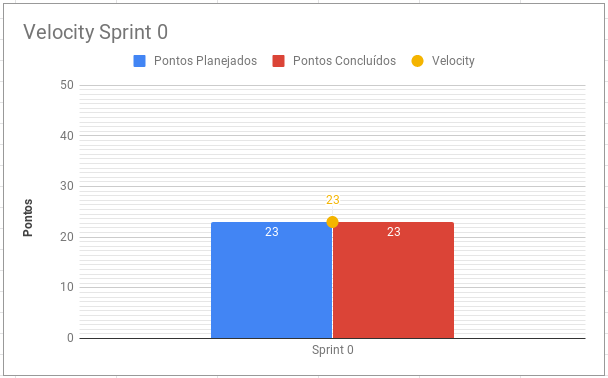

# Resultados Sprint 0
A Sprint 0 obteve êxito na propósito de treinamento e ambientação dos membros ao projeto e manteve um ótimo ritmo de criação de artefatos.

## Fechamento da Sprint

| Issue | Pontos | Status |
| ----- | ------ | ------ |
| [Criação de issue Template (EPS)](https://github.com/fga-eps-mds/2019.1-Grupo-3/issues/1) | 1 | Concluída |
| [Pré-treinamento de conceitos do SCRUM (MDS)](https://github.com/fga-eps-mds/2019.1-Grupo-3/issues/11) | 1 | Concluída |
| [Elaborar documento de visão (MDS)](https://github.com/fga-eps-mds/2019.1-Grupo-3/issues/3) | 8 | Concluída |
| [Criação de template de commits (EPS)](https://github.com/fga-eps-mds/2019.1-Grupo-3/issues/6) | 3 | Concluída |
| [Criação do template de pull request (EPS)](https://github.com/fga-eps-mds/2019.1-Grupo-3/issues/7) | 3 | Concluída |
| [Adição de código de conduta (EPS)](https://github.com/fga-eps-mds/2019.1-Grupo-3/issues/8) | 1 | Concluída |
| [Treinamento de metologias e práticas ágeis (MDS)](https://github.com/fga-eps-mds/2019.1-Grupo-3/issues/4) | 3 | Concluída |
| [Treinamento de git (MDS)](https://github.com/fga-eps-mds/2019.1-Grupo-3/issues/2) | 3 | Concluída |
__Pontos Planejados Concluídos:__ 23

[Milestone Sprint 0](https://github.com/fga-eps-mds/2019.1-Grupo-3/milestone/2)

## Burndown

Por problemas em relação a organização, a sprint 0 ocorreu, mas não teve uma organização formal até o dia do fechamente, por isso obteve essa representação do burndown.

## Velocity
O velocity é de 23 pontos.

## Quadro de Conhecimento

A equipe de EPS elaborou um quadro de conhecimento com tecnologias consideradas essenciais para o desenvolvimento. Com ele foi possível ter um overview das capacidades da equipe de desenvolvimento e gerência, e servirá como referência inicial para rastrear a evolução técnica da equipe. 

## Avaliação do Scrum Master

Apesar da falta de organização formal para esta sprint, obtivemos ótimos resultados em relação às issues concluídas.

Houveram treinamentos para a metodologia e tecnologias que serão usadas, além disso, após a escolha de proposta de projeto, puderam ser criados alguns documentos essenciais. Até então nenhuma métrica foi colocada, além de Burndown e Velocity, por não haver entregáveis de valor para o projeto.