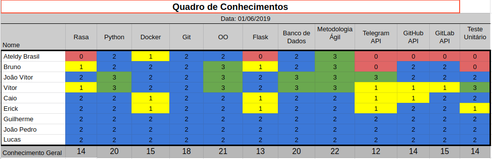

# Resultados Sprint 10

Essa Sprint foi focada na criação do _webhook_ do GitHub, história importante para as próximas _sprints_; cronjob para verificar o _deploy_ do repositório do usuário e histórias relacionadas à informações dos colaboradores. Além disso, refatorações não finalizadas, atualização do T.A.P, _deploy_ do repositório ADA-GitHub e correções nas configurações de testes.

## Fechamento da Sprint
### Issues Planejadas
| Issue | Pontos | Status |
| ----- | ------ | ------ |
| [US20 - Eu, como usuário, desejo que a Ada me informe as issues alocadas para um dos colaboradores que eu informar para auxiliar no gerenciamento de atividades.](https://github.com/fga-eps-mds/2019.1-ADA/issues/235) | 5 | Concluída |
| [US34 - Eu, como usuário, desejo que a Ada me informe os colaboradores do projeto para auxiliar no gerenciamento de atividades.](https://github.com/fga-eps-mds/2019.1-ADA/issues/234) | 3 | Não Concluída |
| [Atualizar Estimativa de Custo no TAP](https://github.com/fga-eps-mds/2019.1-ada/issues/220) | 3 | Concluída |
| [Corrigir configuração de testes](https://github.com/fga-eps-mds/2019.1-ada/issues/228) | 5 | Concluída |
| [Garantir exclusão do banco após execução de testes](https://github.com/fga-eps-mds/2019.1-ada/issues/229) | 5 | Concluída |
| [Realizar deploy do github](https://github.com/fga-eps-mds/2019.1-ADA/issues/230) | 3 | Concluída |
| [Cronjob para verificar o deploy](https://github.com/fga-eps-mds/2019.1-ADA/issues/231) | 8 | Não Concluída |
| [US35 - Eu, como usuário, desejo que a Ada cadastre a minha url do deploy do meu projeto.](https://github.com/fga-eps-mds/2019.1-ADA/issues/232) | 3 | Não Concluída |
| [Refatoração repositório Ada Gitlab](https://github.com/fga-eps-mds/2019.1-ada/issues/209) | 8 | Concluída |
| [Refatoração repositório Ada Github](https://github.com/fga-eps-mds/2019.1-ada/issues/211) | 5 | Não Concluída |
| [Criar webhook GitHub](https://github.com/fga-eps-mds/2019.1-ADA/issues/218) | 5 | Concluída |

__Pontos Planejados:__ 35

__Pontos de Dívida:__ 18

> __Total:__  53 

### Issues Adicionadas

| Issue | Pontos | Status |
| ----- | ------ | ------ |
| [US25 - Eu, como usuário, desejo que a Ada me informe quando um pull request criado por ou atribuído a mim receber uma revisão para que eu possa fazer as alterações necessárias.](https://github.com/fga-eps-mds/2019.1-ADA/issues/243) | 1 | Concluída |
| [US33 - Eu, como usuário, desejo que a Ada me informe quando um comentário de issue for feito.](https://github.com/fga-eps-mds/2019.1-ADA/issues/246) | 1 | Concluída |
| [US36 - Eu, como usuário, desejo que a Ada me informe quando uma issue for criada.](https://github.com/fga-eps-mds/2019.1-ADA/issues/247) | 1 | Concluída |
| [US37 - Eu, como usuário, desejo que a Ada me informe quando um pull request receber uma solicitação de revisão para que eu tenha conhecimento do andamento do projeto.](https://github.com/fga-eps-mds/2019.1-ADA/issues/244) | 1 | Concluída |
| [US38 - Eu, como usuário, desejo que a Ada me informe quando um pull request for aberto para que eu tenha conhecimento do andamento do projeto.](https://github.com/fga-eps-mds/2019.1-ADA/issues/245) | 1 | Concluída |

> __Pontos adicionados:__ 5

> __Total de Pontos Concluídos:__ 39

[Milestone Sprint 10](https://github.com/fga-eps-mds/2019.1-ADA/milestone/11)

## Retrospectiva da Sprint

### Pontos Positivos

* Time continuar
* EPS mais presente 
* DevOps mais organizado 
* P.O. disponível para auxiliar em histórias de desenvolvimento

### Pontos Negativos

* Não conseguimos entregar histórias à tempo
* Time desmotivado
* Time com falta de foco
* Intriga entre MDS

### Pontos à Melhorar

* Organização de tempo para entrega
* Relacionamento entre membros
* Engajamento do time de desenvolvimento
* Comunicação

## Burndown

O gráfico de _burndown_ demonstra a entrega de pontos durante os dias da sprint. 

## Velocity
O _velocity_ é de 44 pontos.

## Burndown de Riscos

 

__Total de pontos de riscos:__ 238*

Este burndown de riscos possui uma escala de 0 a 25 para cada risco acontecer, de acordo com a tabela de avaliação presente no [Plano de Gerenciamento de Riscos](https://fga-eps-mds.github.io/2019.1-ADA/#/docs/project/risk_management_plan?id=_53-avalia%c3%a7%c3%a3o-dos-riscos).

A descrição de cada risco se encontra [aqui](https://fga-eps-mds.github.io/2019.1-ADA/#/docs/project/risk_management_plan?id=_4-identifica%c3%a7%c3%a3o-dos-riscos).

## Quadro de Conhecimento

A equipe de EPS elaborou um quadro de conhecimento com tecnologias consideradas essenciais para o desenvolvimento. Com ele é possível ter um _overview_ das capacidades da equipe de desenvolvimento e gerência. 

A escala vai de 0 a 3, onde 0 é nenhum conhecimento e 3 é alto conhecimento.

## Indicadores de Qualidade do Código

### Serviço [ADA GitHub](https://github.com/fga-eps-mds/2019.1-ADA-github)

#### Manutenibilidade e Duplicação

#### Cobertura de Testes 

### Serviço [ADA GitLab](https://github.com/fga-eps-mds/2019.1-ADA-gitlab)

#### Manutenibilidade e Duplicação

#### Cobertura de Testes 

### Serviço [ADA bot](https://github.com/fga-eps-mds/2019.1-ADA)

#### Manutenibilidade e Duplicação

## Avaliação do Scrum Master

O time de desenvolvimento apresentou certa desmotivação devido ao reta final do período acadêmico. Além disso, foi alegado que histórias de refatoração não estimulavam o time à trabalhar no projeto.
A falta de testes fez com que algumas histórias se tornassem dívidas, como a [US34](https://github.com/fga-eps-mds/2019.1-ADA/issues/234) e a [Refatoração repositório Ada Github](https://github.com/fga-eps-mds/2019.1-ada/issues/211). O arquiteto também mostrou dificuldades na finalização de tarefas como a [US35](https://github.com/fga-eps-mds/2019.1-ADA/issues/232) e a [Cronjob para verificar o deploy](https://github.com/fga-eps-mds/2019.1-ADA/issues/231), mas houveram avanços.
Após a finalização da história de [Criar webhook GitHub](https://github.com/fga-eps-mds/2019.1-ADA/issues/218) pelo DevOps, foi possível adicionar mais 5 histórias de usuário relacionadas à notificações: [US25](https://github.com/fga-eps-mds/2019.1-ADA/issues/243), [US33](https://github.com/fga-eps-mds/2019.1-ADA/issues/246), [US36](https://github.com/fga-eps-mds/2019.1-ADA/issues/247), [US37](https://github.com/fga-eps-mds/2019.1-ADA/issues/244) e [US38](https://github.com/fga-eps-mds/2019.1-ADA/issues/245). Todas as histórias adicionadas foram concluídas.

_\* Riscos relacionados à __tecnologia usada apresentar problemas__, __falta de comunicação da equipe__ e __problemas de saúde de algum membro__ foram diminuídos. As tecnologias usadas mostram estabilidade e o time maturidade em usá-las. Além disso, o grupo já consegue manter uma constância no uso dos meios de comunicação._