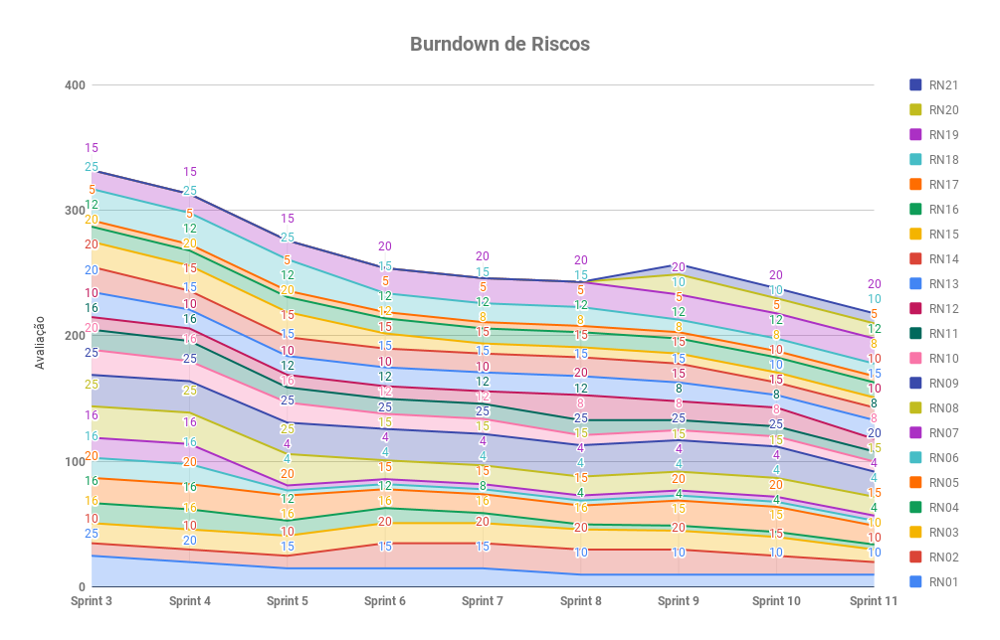

# Resultados Sprint 11

Essa Sprint foi focada em entregar dívidas da sprint passada com histórias importantes, além de _issues_ relacionadas à notificar _Pull Requests_, comentários em _issues_ e o _Mock_ em testes do ADA GitLab.

## Fechamento da Sprint

| Issue | Pontos | Status |
| ----- | ------ | ------ |
| [US17 - Eu, como usuário, desejo que a Ada faça um comentário na issue por mim para entrar em contato com os mantenedores do repositório de maneira mais fácil.](https://github.com/fga-eps-mds/2019.1-ADA/issues/227) | 8 | Concluída |
| [US25 - Eu, como usuário, desejo receber notificação de revisão de Pull Requests](https://github.com/fga-eps-mds/2019.1-ADA/issues/248) | 3 | Concluída |
| [Realizar Mock de testes do repositório Ada-gitlab](https://github.com/fga-eps-mds/2019.1-ADA/issues/251) | 8 | Concluída |
| [Atualizar readmes dos repositórios](https://github.com/fga-eps-mds/2019.1-ADA/issues/255)  | 3 | Concluída |
| [Cadastrar Repositório de Organização do GitLab](https://github.com/fga-eps-mds/2019.1-ADA/issues/254) | 5 | Concluída |
| [US34 - Eu, como usuário, desejo que a Ada me informe os colaboradores do projeto para auxiliar no gerenciamento de atividades.](https://github.com/fga-eps-mds/2019.1-ADA/issues/234) | 3 | Concluída |
| [US35 - Eu, como usuário, desejo que a Ada cadastre a minha url do deploy do meu projeto.](https://github.com/fga-eps-mds/2019.1-ADA/issues/232) | 3 | Concluída |
| [Refatoração repositório Ada Github](https://github.com/fga-eps-mds/2019.1-ada/issues/211) | 5 | Concluída |
| [Cronjob para verificar o deploy](https://github.com/fga-eps-mds/2019.1-ADA/issues/231) | 8 | Concluída |

__Pontos Planejados:__ 27

__Pontos de Dívida:__ 19

__Total:__  46 

> __Pontos Total Concluídos:__ 46

[Milestone Sprint 11](https://github.com/fga-eps-mds/2019.1-ADA/milestone/12)

## Retrospectiva da Sprint

### Pontos Positivos

* Houveram _Feedbacks_ para o time de MDS
* Equipe mais engajada
* Comunicação muito boa
* Alguns pareamento foram muito produtivos
* Todas as histórias foram entregues

### Pontos Negativos

* Histórias não entregues do jeito que esperávamos
* Falhas na comunicação em um pareamento
* Um pareamento não aconteceu por conflitos de horários
* Sobrecarga em um dos pareamentos

### Pontos à Melhorar

* Comunicação
* Organização para submeter _PRs_ mais rápidos
* Organizar para aceitar _PRs_ mais rápidos
* Organização das Histórias
* Melhorar funcionalidades

## Burndown

O gráfico de burndown demonstra a entrega de pontos durante os dias da sprint. 

## Velocity

O velocity é de 44,17 pontos.

## Burndown de Riscos

 

__Total de pontos de riscos:__ 218

Este burndown de riscos possui uma escala de 0 a 25 para cada risco acontecer, de acordo com a tabela de avaliação presente no [Plano de Gerenciamento de Riscos](https://fga-eps-mds.github.io/2019.1-ADA/#/docs/project/risk_management_plan?id=_53-avalia%c3%a7%c3%a3o-dos-riscos).

A descrição de cada risco se encontra [aqui](https://fga-eps-mds.github.io/2019.1-ADA/#/docs/project/risk_management_plan?id=_4-identifica%c3%a7%c3%a3o-dos-riscos).

## Quadro de Conhecimento

A equipe de EPS elaborou um quadro de conhecimento com tecnologias consideradas essenciais para o desenvolvimento. Com ele é possível ter um _overview_ das capacidades da equipe de desenvolvimento e gerência. 

A escala vai de 0 a 3, onde 0 é nenhum conhecimento e 3 é alto conhecimento.

## Indicadores de Qualidade do Código

### Serviço [ADA GitHub](https://github.com/fga-eps-mds/2019.1-ADA-github)

#### Manutenibilidade e Duplicação

#### Cobertura de Testes 

### Serviço [ADA GitLab](https://github.com/fga-eps-mds/2019.1-ADA-gitlab)

#### Manutenibilidade e Duplicação

#### Cobertura de Testes 

### Serviço [ADA bot](https://github.com/fga-eps-mds/2019.1-ADA)

#### Manutenibilidade e Duplicação

## Avaliação do Scrum Master

Nessa sprint, o time volta a completar todas as histórias planejadas juntamente com as dívidas herdadas de sprints anteriores.

É possível notar que o _burndown da sprint_ continua caindo apenas na reta final da sprint, o que já é esperado, pois nesta fase o time cumpre tarefas mais complexas. Já o _velocity_ continua praticamente constante, apesar dos impedimentos relacionados ao final do semestre letivo, demonstrando uma certa ordenação de todo o time. 

Para entender alguns gargalos referentes ao entrosamento da equipe, o _Scrum Master_ juntamente com o time de EPS organizou uma conversa com cada um do time de desenvolvimento para coletar insumos sobre o que podemos melhorar. Isso resultou em _feedbacks_ para aprimorar a comunicação e organização do grupo como um todo.

_\* Riscos relacionados à __mudança de escopo__, __atividades não entregues no prazo__, __dificuldades em testes__, __execução da arquitetura__ e __problemas nas tecnologias__ foram diminuídos. Apesar do time apresentar maturidade, foi notado falhas na comunicação ém alguns pareamentos e que foram tratadas na Sprint Review como um feedback para melhoria profissional_

_\*\* O P.O. Vítor Gomes também atuou como __desenvolvedor__ na issue __Realizar Mock de testes do repositório Ada-gitlab__._
_O arquiteto Bruno Dantas atuou como __desenvolvedor__ nas issues __Cronjob para verificar o deploy__ e __US35__._
