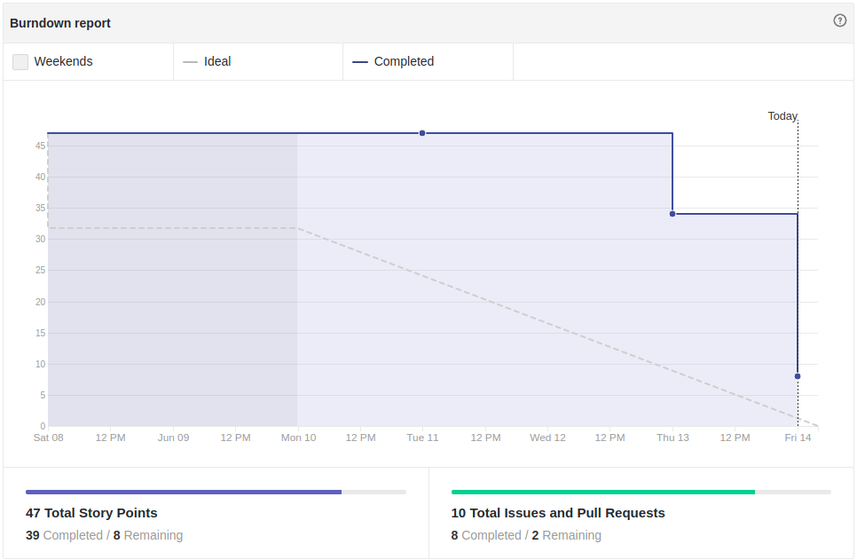
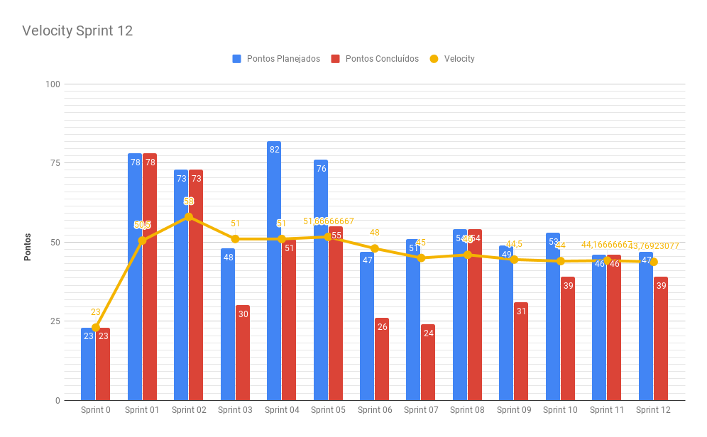
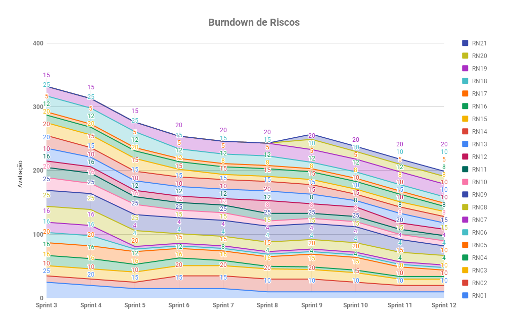
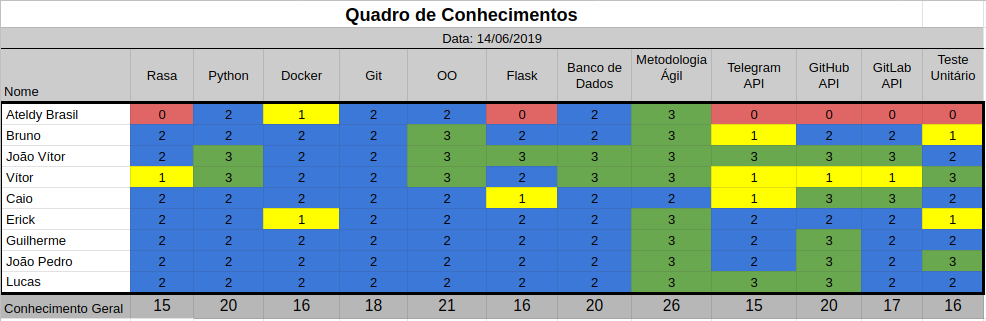
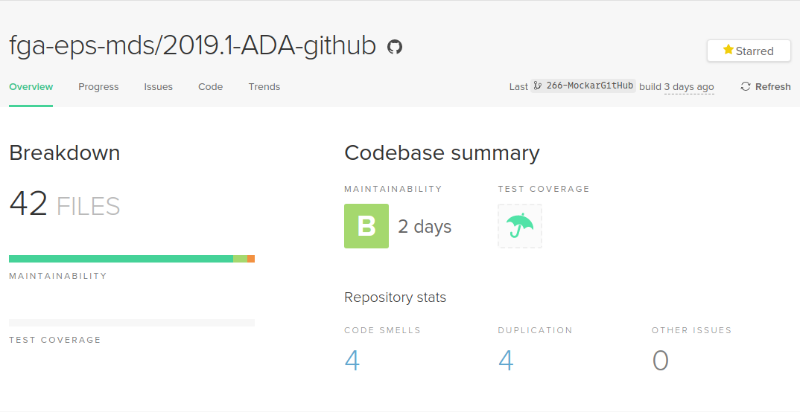
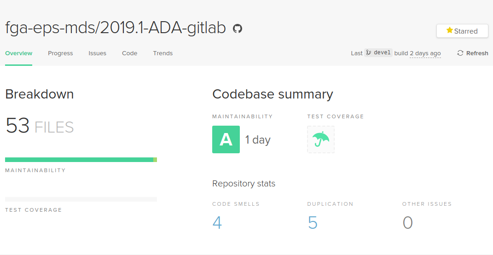
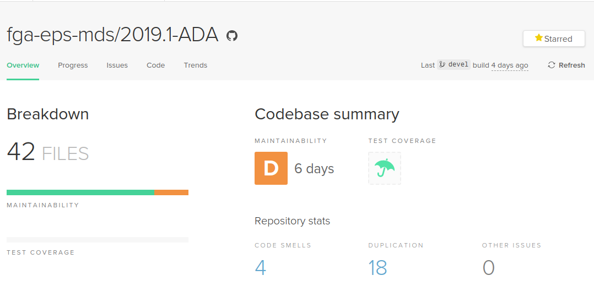

# Resultados Sprint 12

Essa Sprint foi focada em melhorias de funcionalidades já implementadas e testes unitários usando _mock_. Além disso, foram feitos testes em uso com potenciais usuários a fim de levantar melhorias para as próximas _sprints_.

## Fechamento da Sprint

| Issue | Pontos | Status |
| ----- | ------ | ------ |
| [US39 - Eu, como usuário, desejo poder recadastrar meu repositório do Github.](https://github.com/fga-eps-mds/2019.1-ada/issues/262) | 8 | Concluída |
| [US40 - Eu, como usuário, desejo poder recadastrar meu repositório do Gitlab.](https://github.com/fga-eps-mds/2019.1-ADA/issues/278) | 8 | Não Concluída |
| [Melhorar comentário da Issue, por meio de reply](https://github.com/fga-eps-mds/2019.1-ada/issues/263) | 8 | Concluída |
| [Melhoria no fluxo de conversa](https://github.com/fga-eps-mds/2019.1-ada/issues/265) | 5 | Concluída |
| [Mockar testes do serviço do GitHub](https://github.com/fga-eps-mds/2019.1-ada/issues/266) | 8 | Concluída |
| [Teste em Uso Sprint 12](https://github.com/fga-eps-mds/2019.1-ada/issues/267) | 5 | Concluída |
| [Cadastrar Repositório de organizações no AdaGithub](https://github.com/fga-eps-mds/2019.1-ADA/issues/272) | 8 | Concluída |

__Pontos Planejados:__ 47

__Pontos de Dívida:__ 0

__Total:__  47 

> __Pontos Total Concluídos:__ 39

> [Milestone Sprint 12](https://github.com/fga-eps-mds/2019.1-ADA/milestone/13)

## Retrospectiva da Sprint

### Pontos Positivos

* Time engajado
* Pareamentos funcionaram
* Time mais maduro
* Quase todas as histórias concluídas

### Pontos Negativos

* DevOps sobrecarregado aceitando PR's
* História subestimada
* Sprint mais curta

### Pontos à Melhorar

* Comunicação da equipe
* Integração da equipe

## Burndown

O gráfico de burndown demonstra a entrega de pontos durante os dias da sprint. 

## Velocity
O velocity é de 43,8 pontos.

## Burndown de Riscos

 

__Total de pontos de riscos:__ 199

Este burndown de riscos possui uma escala de 0 a 25 para cada risco acontecer, de acordo com a tabela de avaliação presente no [Plano de Gerenciamento de Riscos](https://fga-eps-mds.github.io/2019.1-ADA/#/docs/project/risk_management_plan?id=_53-avalia%c3%a7%c3%a3o-dos-riscos).

A descrição de cada risco se encontra [aqui](https://fga-eps-mds.github.io/2019.1-ADA/#/docs/project/risk_management_plan?id=_4-identifica%c3%a7%c3%a3o-dos-riscos).

## Quadro de Conhecimento

A equipe de EPS elaborou um quadro de conhecimento com tecnologias consideradas essenciais para o desenvolvimento. Com ele é possível ter um overview das capacidades da equipe de desenvolvimento e gerência. 

A escala vai de 0 a 3, onde 0 é nenhum conhecimento e 3 é alto conhecimento.

## Indicadores de Qualidade do Código

### Serviço [ADA GitHub](https://github.com/fga-eps-mds/2019.1-ADA-github)

#### Manutenibilidade e Duplicação

#### Cobertura de Testes 

### Serviço [ADA GitLab](https://github.com/fga-eps-mds/2019.1-ADA-gitlab)

#### Manutenibilidade e Duplicação

#### Cobertura de Testes 

### Serviço [ADA bot](https://github.com/fga-eps-mds/2019.1-ADA)

#### Manutenibilidade e Duplicação

## Avaliação do Scrum Master

Nessa sprint, o foco foi em melhorias da funcionalidades e todas as histórias planejadas foram concluídas com exceção da [US40](https://github.com/fga-eps-mds/2019.1-ADA/issues/278) que foi parcialmente feita.

O _burndown da sprint_ continua caindo apenas na reta final da sprint, o que pode está associado ao final de semestre, onde o time tem que conciliar as provas e os trabalhos com o desenvolvimento das histórias. Já o _velocity_ continua quase constante. 

A cobertura de testes tanto nos repositórios [ADA GitHub](https://github.com/fga-eps-mds/2019.1-ADA-github) e [ADA GitLab](https://github.com/fga-eps-mds/2019.1-ADA-gitlab) estão 96% e 98% respectivamente, o que demostra a maturidade do time em relação à testes. 

_\* Riscos relacionados à __atividades não entregues no prazo__, __dificuldades em testes__, __falta de comunicação da equipe__ e __perda/defeito em equipamentos__ foram diminuídos. Para melhoria da comunicação e relacionamento entre membros, foram feitos feedbacks e constante alinhamento entre os pareamentos._
