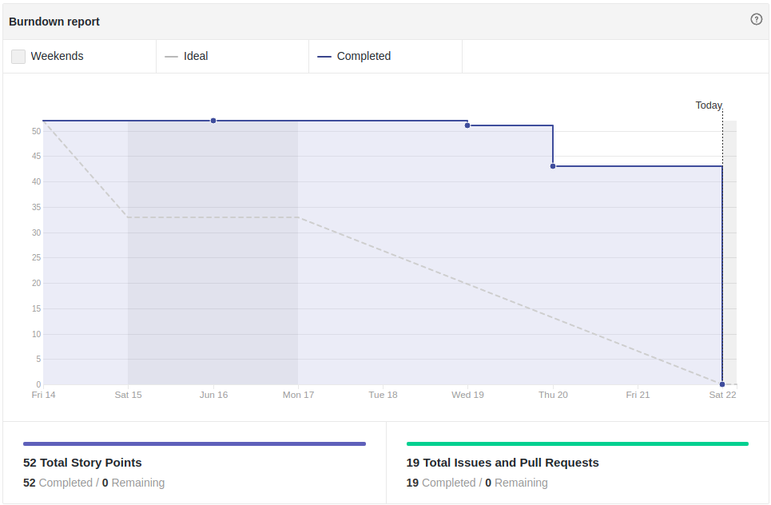
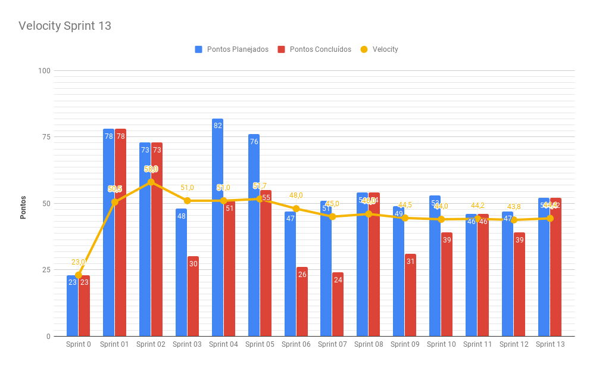
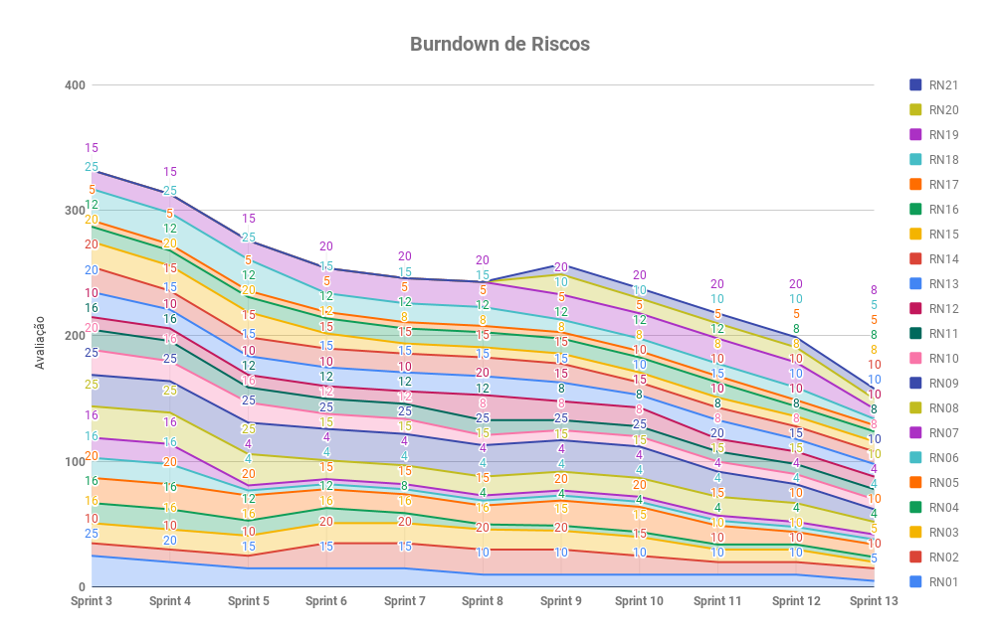
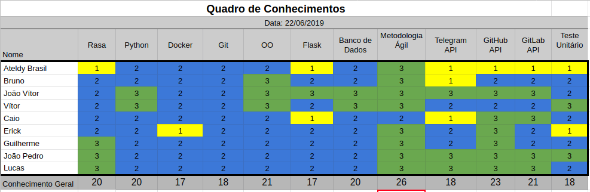
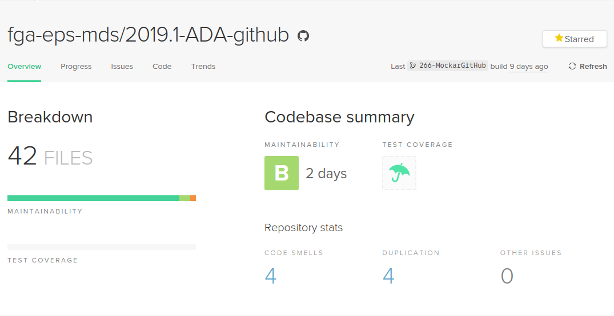
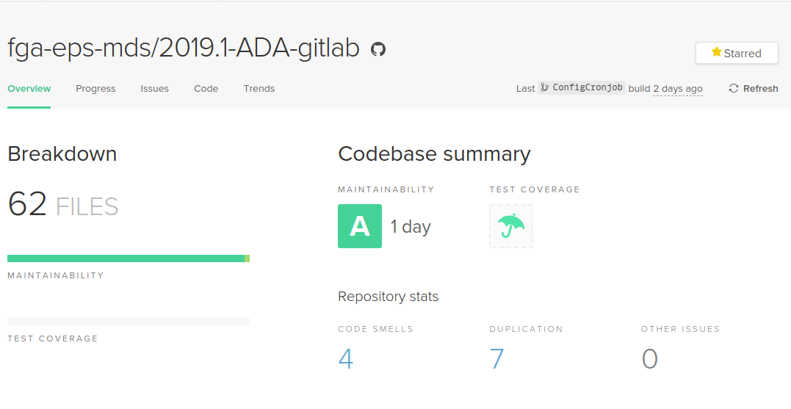
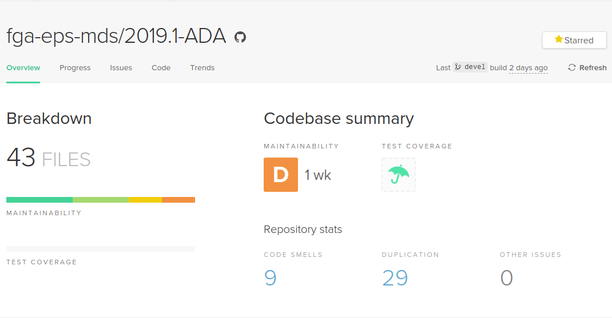

# Resultados Sprint 13

Essa Sprint foi focada em melhorias de funcionalidades já implementadas, atualização de documentação e preparação para a Release 2. Foram adicionadas nessa 
_Sprint_ issues resultantes do Teste em Uso realizado na _sprint_ passada. 

## Fechamento da Sprint

| Issue | Pontos | Status |
| ----- | ------ | ------ |
| [Aprimorar ajuda da Ada](https://github.com/fga-eps-mds/2019.1-ADA/issues/273) | 1 | Concluída |
| [Garantir que o usuário se cadastre antes de fazer pedidos a Ada](https://github.com/fga-eps-mds/2019.1-ADA/issues/275) | 5 | Concluída |
| [Aprimorar fluxo de conversa de retorno de colaboradores](https://github.com/fga-eps-mds/2019.1-ADA/issues/274) | 1 | Concluída |
| [Aprimorar fluxo de conversa para monitoramento do estado da aplicação](https://github.com/fga-eps-mds/2019.1-ADA/issues/276) | 1 | Concluída |
| [Criar explicações sobre como fazer algumas ações junto a Ada](https://github.com/fga-eps-mds/2019.1-ADA/issues/286) | 1 | Concluída |
| [Lista de repositórios: pegar apenas aqueles que o usuário é colaborador](https://github.com/fga-eps-mds/2019.1-ADA/issues/288) | 5 | Concluída |
| [Atualizar o Community profile do repositório ADA-Github](https://github.com/fga-eps-mds/2019.1-ADA/issues/293) | 2 | Concluída |
| [Atualizar a descrição de ferramentas e métricas utilizadas](https://github.com/fga-eps-mds/2019.1-ADA/issues/294) | 1 | Concluída |
| [Atualizar Resultados das Sprints](https://github.com/fga-eps-mds/2019.1-ADA/issues/295) | 1 | Concluída |
| [Refatorar relatório do GitLab](https://github.com/fga-eps-mds/2019.1-ADA/issues/298) | 13 | Concluída |
| [Documento para explicação e apresentação da EVM](https://github.com/fga-eps-mds/2019.1-ADA/issues/301) | 3 | Concluída |
| [Atualização de documentos](https://github.com/fga-eps-mds/2019.1-ADA/issues/302) | 3 | Concluída |
| [Configurar Cronjob](https://github.com/fga-eps-mds/2019.1-ADA/issues/304) | 5 | Concluída |
| [Atualização do Documento de Arquitetura](https://github.com/fga-eps-mds/2019.1-ADA/issues/305) | 2 | Concluída |
| [US40 - Eu, como usuário, desejo poder recadastrar meu repositório do Gitlab para o utilizar a Ada em outro repositório.](https://github.com/fga-eps-mds/2019.1-ADA/issues/278) | 8 | Concluída |

__Pontos Planejados:__ 44

__Pontos de Dívida:__ 8

__Total:__  52 

> __Pontos Total Concluídos:__ 52

[Milestone Sprint 13](https://github.com/fga-eps-mds/2019.1-ADA/milestone/14)

## Retrospectiva da Sprint

### Pontos Positivos

* O time continua engajado
* Paramentos funcionaram
* Todos se ajudaram nessa sprint
* A comunicação melhorou 
* Projeto pode ser continuado

### Pontos Negativos

* Ainda não foi preparada uma apresentação para a Release 1
* Parte do time só começou a realizar as issues a partir da quarta-feira, por motivos de provas
* Demora na organização da reunião dessa sprint

### Pontos à Melhorar

* Comunicação da equipe

## Burndown

O gráfico de burndown demonstra a entrega de pontos durante os dias da sprint. 

## Velocity
O velocity é de 44,4 pontos.

## Burndown de Riscos

 

__Total de pontos de riscos:__ 158

Este burndown de riscos possui uma escala de 0 a 25 para cada risco acontecer, de acordo com a tabela de avaliação presente no [Plano de Gerenciamento de Riscos](https://fga-eps-mds.github.io/2019.1-ADA/#/docs/project/risk_management_plan?id=_53-avalia%c3%a7%c3%a3o-dos-riscos).

A descrição de cada risco se encontra [aqui](https://fga-eps-mds.github.io/2019.1-ADA/#/docs/project/risk_management_plan?id=_4-identifica%c3%a7%c3%a3o-dos-riscos).

## Quadro de Conhecimento

A equipe de EPS elaborou um quadro de conhecimento com tecnologias consideradas essenciais para o desenvolvimento. Com ele é possível ter um overview das capacidades da equipe de desenvolvimento e gerência. 

A escala vai de 0 a 3, onde 0 é nenhum conhecimento e 3 é alto conhecimento.

## Indicadores de Qualidade do Código

### Serviço [ADA GitHub](https://github.com/fga-eps-mds/2019.1-ADA-github)

#### Manutenibilidade e Duplicação

#### Cobertura de Testes 

### Serviço [ADA GitLab](https://github.com/fga-eps-mds/2019.1-ADA-gitlab)

#### Manutenibilidade e Duplicação

#### Cobertura de Testes 

### Serviço [ADA bot](https://github.com/fga-eps-mds/2019.1-ADA)

#### Manutenibilidade e Duplicação

## Avaliação do Scrum Master

Nessa sprint, o foco foi em melhorias de funcionalidades já implementadas, atualização de documentação e preparação para a Release 2. Todas as histórias planejadas foram entregues.

O _burndown da sprint_ demonstrou que entrega de histórias começaram na metade da sprint, o que pode estar associado ao fato de boa parte do time estava comprometido com provas até esse período. Já o _velocity_ continua praticamente constante. 

A cobertura de testes tanto nos repositórios [ADA GitHub](https://github.com/fga-eps-mds/2019.1-ADA-github) e [ADA GitLab](https://github.com/fga-eps-mds/2019.1-ADA-gitlab) estão 96% e 98% respectivamente, o que demostra a maturidade do time em relação à testes. 

_\* Riscos relacionados ao __projeto não atender os requisitos, execução da arquitetura, baixa qualidade do produto final, prazos das atividades, qualidade de software não corresponder às expectativas do cliente, greve na UnB e problemas de saúde de algum membro__ foram diminuídos._

_\*\* O arquiteto Bruno Dantas atuou como desenvolvedor na issue __US40__._
_O DevOps João Vítor atuou como desenvolvedor na issue __Refatorar relatório do GitLab__._