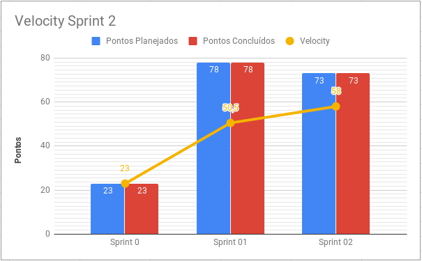
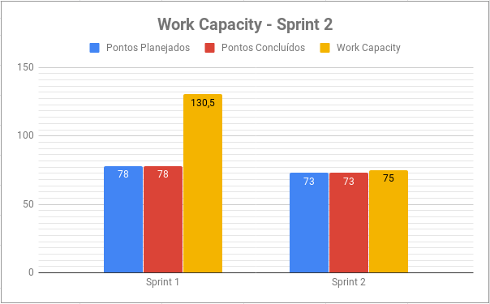
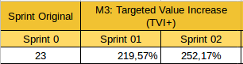
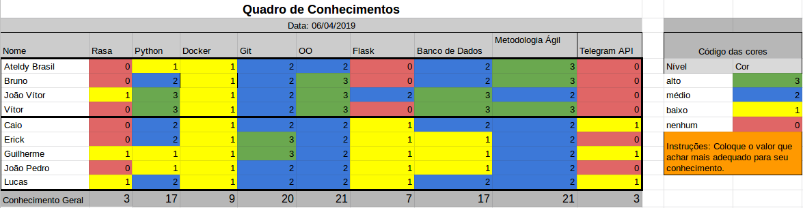

# Resultados Sprint 2

Nessa Sprint foram finalizados e evoluidos documentos, o ambiente de desenvolvimento foi preparado e primeiros códigos foram feitos.

## Fechamento da Sprint

| Issue | Pontos | Status |
| ----- | ------ | ------ |
| [DS01- Eu, como desenvolvedor, quero que todo o ambiente de desenvolvimento da Ada esteja uniformizado para padronizar o desenvolvimento.](https://github.com/fga-eps-mds/2019.1-ADA/issues/52) | 5 | Concluído |
| [DS02 - Eu, como desenvolvedor, quero criar um banco de dados que guarde informações do Telegram para conseguir comunicação estável com a Ada.](https://github.com/fga-eps-mds/2019.1-ADA/issues/54) | 13 | Concluído |
| [DS03 - Eu, como desenvolvedor, quero que todo o ambiente de desenvolvimento do Monitoramento da integração contínua para padronizar o desenvolvimento.](https://github.com/fga-eps-mds/2019.1-ADA/issues/53) | 5 | Concluído |
| [DS05 - Eu, como Ada, quero ter um protótipo de alta fidelidade, para me mostrar ao mundo.](https://github.com/fga-eps-mds/2019.1-ADA/issues/55) | 8 | Concluído |
| [DS11 - Eu, como desenvolvedor, quero conectar o Rasa ao Telegram para que a Ada possa conversar com o usuário.](https://github.com/fga-eps-mds/2019.1-ADA/issues/56) | 13 | Concluído |
| [Treinamento de Docker](https://github.com/fga-eps-mds/2019.1-ADA/issues/57) | 3 | Concluído |
| [Planejamento de Risco](https://github.com/fga-eps-mds/2019.1-ADA/issues/58) | 5 | Concluído |
| [Evolução do GitFlow](https://github.com/fga-eps-mds/2019.1-ADA/issues/59) | 3 | Concluído |
| [Evolução do Documento de Arquitetura](https://github.com/fga-eps-mds/2019.1-ADA/issues/60) | 8 | Concluído |
| [Criar Roadmap do Produto](https://github.com/fga-eps-mds/2019.1-ADA/issues/61) | 5 | Concluído |
| [Criar Roadmap dos papéis](https://github.com/fga-eps-mds/2019.1-ADA/issues/62) | 5 | Concluído |

__Pontos Planejados:__ 73
__Pontos Planejados Concluídos:__ 73

[Milestone Sprint 2](https://github.com/fga-eps-mds/2019.1-ADA/milestone/3)

## Retrospectiva da Sprint

### Pontos Positivos

* Todos continuam animados para fazer o projeto
* Comprometimento, engajamento e proatividade da equipe
* Localização da reunião
* Todos comentando issues
* Ajuda de EPS
* Treinamento de Docker e Mongo
* Pontuação condizente 
* DevOps auxiliando equipe de desenvolvimento
* Equipe de desenvolvimento buscou conhecimento externo para concluir histórias
* Comparecimento de toda a equipe nas reuniões
* Validação constante com cliente

### Pontos Negativos

* Todas as histórias terminaram muito tarde
* Planejamento de histórias equivocado
* Treinamento deviam ser no começo da sprint

### Pontos à Melhorar

* Entregar as histórias mais cedos
* Comunicação da equipe
* Planejamento das histórias

## Burndown

O gráfico de burndown demonstra a entrega de pontos durante os dias da sprint. 

## Velocity
O velocity é de 58 pontos.

## Work Capacity

A métrica de Work Capacity mede o quanto de esforço cada membro teve em cada dia da sprint. O total de esforço foi de 75 pontos. Isso significa que as tarefas planejadas exigiram um esforço similar aos pontos planejados.

## Targeted Value Increase (TVI+)

## Quadro de Conhecimento

A equipe de EPS elaborou um quadro de conhecimento com tecnologias consideradas essenciais para o desenvolvimento. Com ele é possível ter um overview das capacidades da equipe de desenvolvimento e gerência. 

## Avaliação do Scrum Master

Apesar do atraso nas estregas das histórias, por ser a primeira sprint com desenvolvimento de código, todas as histórias planejadas foram concluídas. A estimativa de esforço se aproximou dos pontos planejados, o que demonstra que a equipe está trabalhando o suficiente para entregar as tarefas.