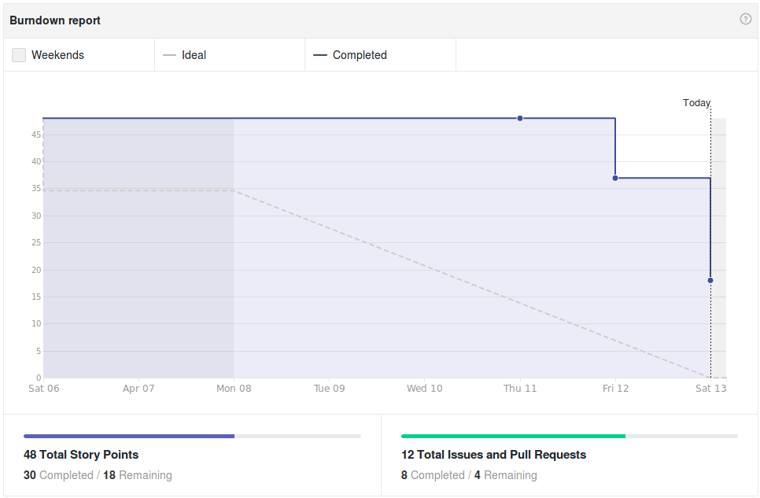
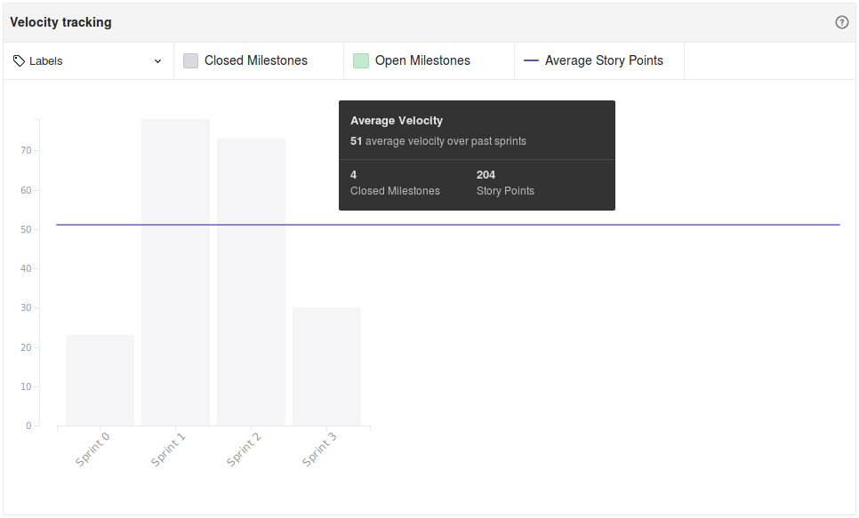
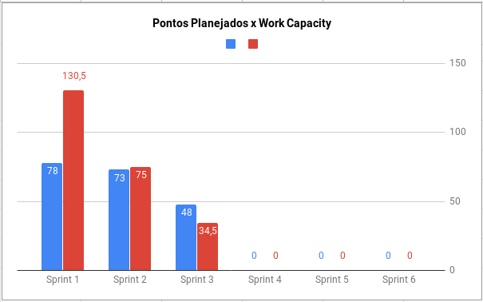
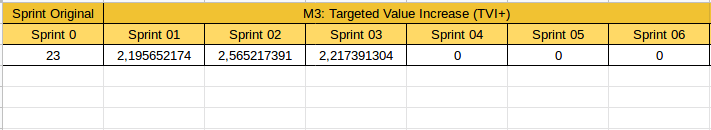
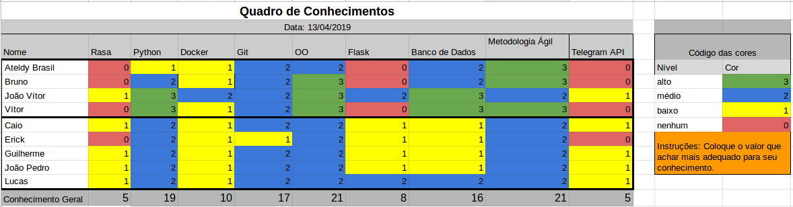

# Resultados Sprint 3

Esta sprint foi focada em desenvolvimento, as principais histórias foram a respeito da interação do usuário com a ADA sobre a build e passos iniciais para a produção de relatório do gitlab.

## Fechamento da Sprint

| Issue | Pontos | Status |
| ----- | ------ | ------ |
| [US04 - Eu, como usuário, desejo ser cumprimentado pela Ada para iniciar uma conversa.](https://github.com/fga-eps-mds/2019.1-ADA/issues/87) | 3 | Concluída |
| [US10 - Eu, como usuário, desejo saber quais os passos da build para me manter informado do processo.](https://github.com/fga-eps-mds/2019.1-ADA/issues/89) | 5 | Não concluída |
| [US26 - Eu, como usuário, desejo me cadastrar com a Ada a partir do GitLab para receber notificações e gerenciar aplicações.](https://github.com/fga-eps-mds/2019.1-ADA/issues/88) | 13 | Não concluída |
| [Elaborar Matriz Eliminar-Reduzir-Elevar-Criar](https://github.com/fga-eps-mds/2019.1-ADA/issues/90) | 8 | Concluída |
| [Definir Identidade Visual](https://github.com/fga-eps-mds/2019.1-ADA/issues/91) | 3 | Concluída |
| [Elaboração do Burndown de Riscos](https://github.com/fga-eps-mds/2019.1-ADA/issues/92) | 5 | Concluída |
| [Treinamento de GitLab/Rasa](https://github.com/fga-eps-mds/2019.1-ADA/issues/93) | 3 | Concluída |
| [Criar Mirror do repositório do GitHub e criar ambiente de testes](https://github.com/fga-eps-mds/2019.1-ADA/issues/94) | 8 | Concluída |

__Pontos Planejados:__ 48
__Pontos Concluídos:__ 30

[Milestone Sprint 3](https://github.com/fga-eps-mds/2019.1-ADA/milestone/4)

## Retrospectiva da Sprint

### Pontos Positivos

* Time empenhado
* Reuniões presenciais para trabalhar
* DevOps sempre presente com o time de desenvolvimento
* Time de desenvolvimento indo atrás de ajuda e conhecimento

### Pontos Negativos

* Time de desenvolvimento com provas
* Subestimação da US
* Time de desenvolvimento dependente do DevOps
* Arquiteto ausente
* Pareamento remoto
* Dificuldade com a tecnologia
* Problemas no ambiente 
* Critérios de aceitação não descrito corretamente pela falta de conhecimento técnico de EPS

### Pontos à Melhorar

* Planejamento das Histórias
* Descrição e critérios de aceitação da issues
* Comunicação  constante

## Burndown

O gráfico de burndown demonstra a entrega de pontos durante os dias da sprint. 

## Velocity
O velocity é de 51 pontos.

## Work Capacity

A métrica de Work Capacity mede o quanto de esforço cada membro teve em cada dia da sprint. O total de esforço foi de 34,5 pontos. Isso significa que o esforço feito foi menor que o planejado, isso pode ser reflexo das histórias não concluídas.

## Targeted Value Increase (TVI+)

## Burndown de Riscos

__Total de pontos de riscos:__ 332

Este burndown de riscos possui uma escala de 0 a 25 para cada risco acontecer, de acordo com a tabela de avaliação presente no [Plano de Gerenciamento de Riscos](https://fga-eps-mds.github.io/2019.1-ADA/#/docs/project/risk_management_plan?id=_53-avalia%c3%a7%c3%a3o-dos-riscos).

A descrição de cada risco se encontra [aqui](https://fga-eps-mds.github.io/2019.1-ADA/#/docs/project/risk_management_plan?id=_4-identifica%c3%a7%c3%a3o-dos-riscos).

Obs: Por ser a primeira sprint onde o burndown de risco foi implementado o burndown se tornou constante.

## Quadro de Conhecimento

A equipe de EPS elaborou um quadro de conhecimento com tecnologias consideradas essenciais para o desenvolvimento. Com ele é possível ter um overview das capacidades da equipe de desenvolvimento e gerência. 

## Avaliação do Scrum Master

Nessa sprint houveram dificuldades para concluir a US10 e US26. As histórias exigiram um esforço a mais para serem executadas e não foram estregues a tempo, tornando-as dívidas técnicas para a sprint seguinte.
