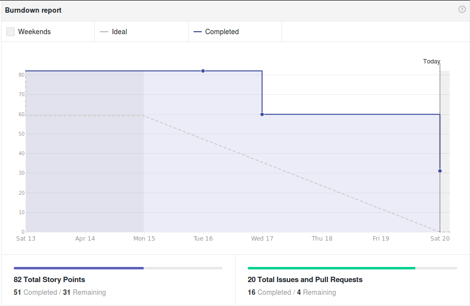
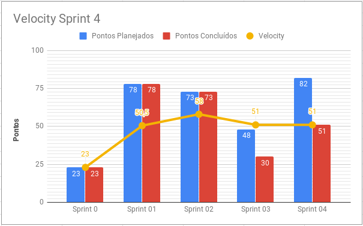
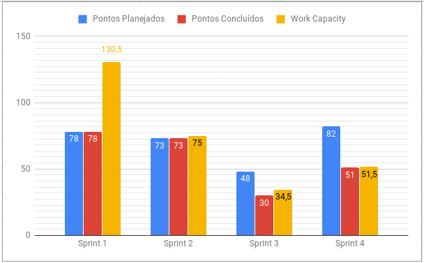
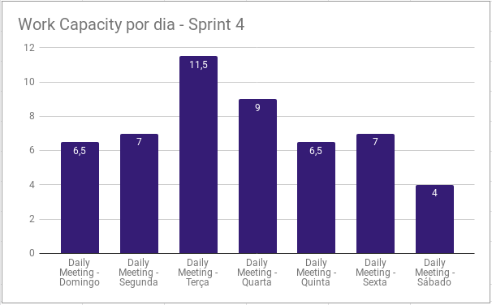
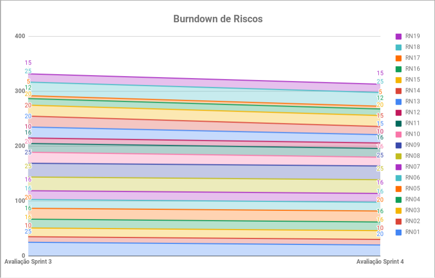
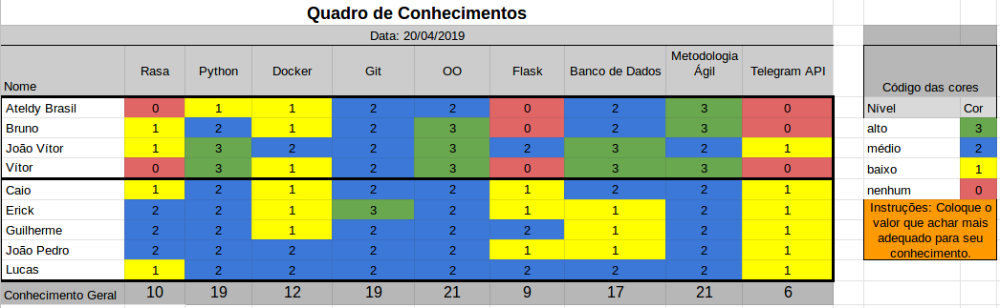

# Resultados Sprint 4

Esta sprint foi focada na finalização de dívidas técnicas da sprint anterior e no desenvolvimento de histórias relacionadas à informações e notificações sobre a build em que a ADA monitora.

## Fechamento da Sprint

| Issue | Pontos | Status |
| ----- | ------ | ------ |
| [US07 - Eu, como usuário, desejo ser notificado sobre o resultado de builds para saber o estado de integração contínua.](https://github.com/fga-eps-mds/2019.1-ADA/issues/110) | 13 | Não Concluída |
| [US09 - Eu, como usuário, desejo saber o estágio da build para saber o andamento do processo.](https://github.com/fga-eps-mds/2019.1-ADA/issues/109) | 8 | Concluída |
| [Refatorar fluxos de conversa](https://github.com/fga-eps-mds/2019.1-ADA/issues/112) | 5 | Concluída |
| [Matriz de Avaliação de Valor](https://github.com/fga-eps-mds/2019.1-ADA/issues/111) | 13 | Concluída |
| [Escolher pipeline do Machine learning](https://github.com/fga-eps-mds/2019.1-ADA/issues/113) | 3 | Concluída |
| [Melhoria na Arquitetura](https://github.com/fga-eps-mds/2019.1-ADA/issues/114) | 5 | Não Concluída |
| [Refatorar formatação de documentosno GitHub Pages](https://github.com/fga-eps-mds/2019.1-ADA/issues/115) | 1 | Concluída |
| [Fazer Plano de Medição](https://github.com/fga-eps-mds/2019.1-ADA/issues/116) | 3 | Concluída |
| [Criar webhook receiver no serviço de gitlab](https://github.com/fga-eps-mds/2019.1-ADA/issues/117) | 5 | Não Concluída |
| [Fazer Deploy dos serviços](https://github.com/fga-eps-mds/2019.1-ADA/issues/118) | 8 | Não Concluída |
| [US10 - Eu, como usuário, desejo saber quais os passos da build para me manter informado do processo.](https://github.com/fga-eps-mds/2019.1-ADA/issues/89) | 5 |Concluída|
| [US26 - Eu, como usuário, desejo me cadastrar com a Ada a partir do GitLab para receber notificações e gerenciar aplicações.](https://github.com/fga-eps-mds/2019.1-ADA/issues/88) | 13 | Concluída|

__Pontos Planejados :__ 64
__Pontos de Dívida :__ 18

 Total de pontos da <i>sprint</i>: 82 
  

 Total de pontos concluídos: 51 
  

> [Milestone Sprint 4](https://github.com/fga-eps-mds/2019.1-ADA/milestone/5)

## Retrospectiva da Sprint

### Pontos Positivos

* MDS mais maduro em relação ao código
* Pareamentos produtivos
* Equipe engajada
* Ajuda coletiva

### Pontos Negativos

* Não conseguimos entregar tudo
* DevOps não conseguiu entregar histórias relacionadas ao deploy
* Desmotivação
* Um pareamento não foi em sintonia
* Horários para parear ruins
* Arquiteto não entregou suas histórias

### Pontos à Melhorar

* Planejamento do DevOps
* Planejamento do Arquiteto
* Comunicação entre a equipe
* EPS ajudar mais MDS

## Burndown

O gráfico de burndown demonstra a entrega de pontos durante os dias da sprint. 

## Velocity
O velocity é de 51 pontos.

## Work Capacity

A métrica de Work Capacity mede a sensação de esforço de cada membro na sprint. O total de esforço foi de 51,5 pontos. 

### Work Capacity por Dia de Sprint

Demonstra a sensação de esforço em cada dia dessa sprint.

## Targeted Value Increase (TVI+)

## Burndown de Riscos

 

__Total de pontos de riscos:__ 313

Este burndown de riscos possui uma escala de 0 a 25 para cada risco acontecer, de acordo com a tabela de avaliação presente no [Plano de Gerenciamento de Riscos](https://fga-eps-mds.github.io/2019.1-ADA/#/docs/project/risk_management_plan?id=_53-avalia%c3%a7%c3%a3o-dos-riscos).

A descrição de cada risco se encontra [aqui](https://fga-eps-mds.github.io/2019.1-ADA/#/docs/project/risk_management_plan?id=_4-identifica%c3%a7%c3%a3o-dos-riscos).

## Quadro de Conhecimento

A equipe de EPS elaborou um quadro de conhecimento com tecnologias consideradas essenciais para o desenvolvimento. Com ele é possível ter um overview das capacidades da equipe de desenvolvimento e gerência. 

## Avaliação do Scrum Master

A sprint 4 herdou duas histórias da sprint passada, US10 e US26. As histórias foram finalizadas, mas novas tarefas não foram concluídas porque dependiam de uma preparação do DevOps.

O DevOps obteve uma carga maior, auxiliando o time de desenvolvimento a cumprir as tarefas e pelos impedimentos relacionados ao deploy. O arquiteto não concluiu sua tarefa de documentar a Melhoria da Arquitetura por uma falta de planejamento e organização pessoal.

Apesar de falhas de comunicação pontuais, o time de desenvolvimento apresentou-se mais maduro em relação ao código nesta sprint e em colaboração coletiva.
