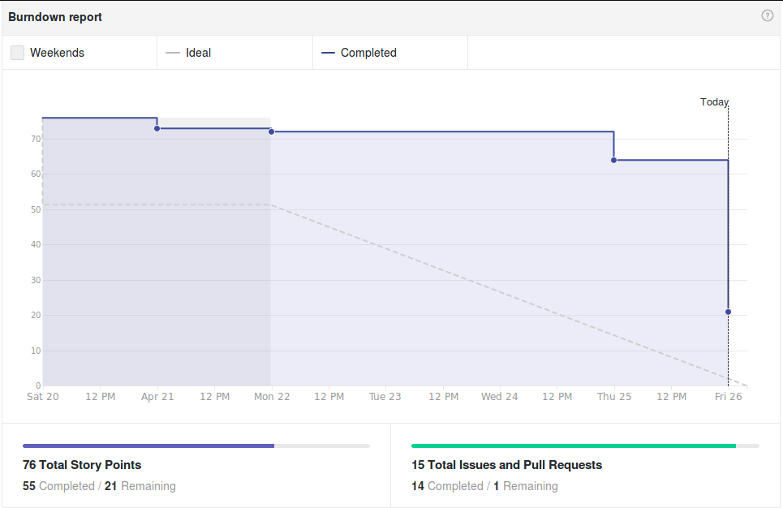
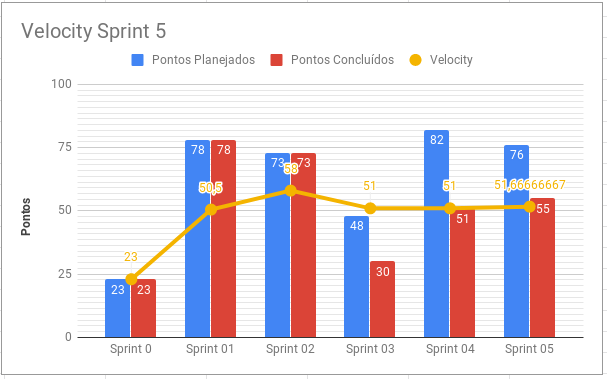
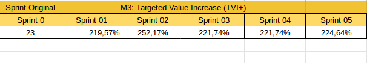
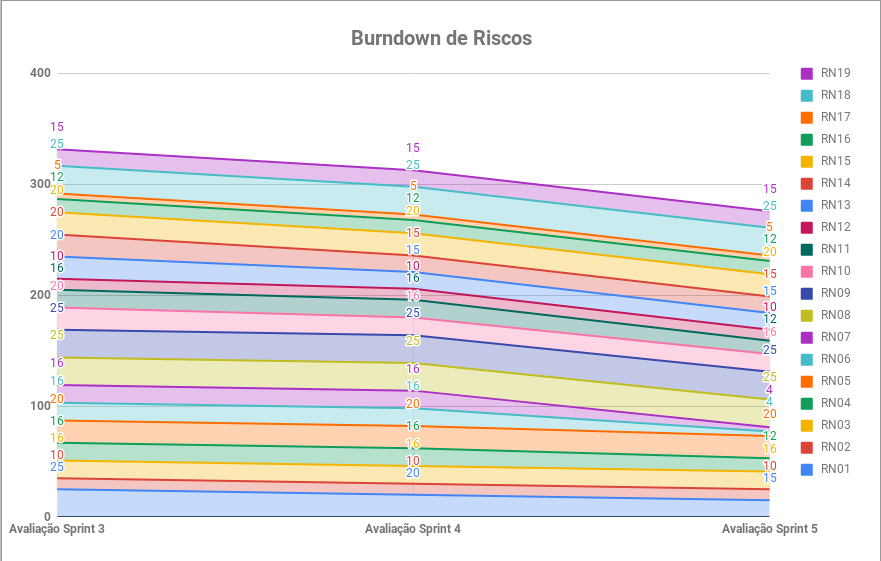
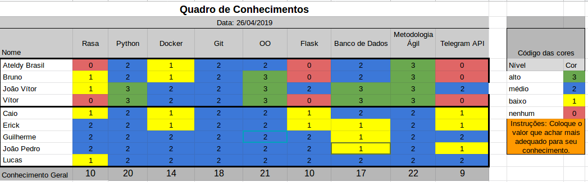

# Resultados Sprint 5

A sprint 5 foi focada nas dívidas de histórias relacionadas a arquitetura, deploy e webhook. Além disso, foram planejadas histórias para a produção de um relatório do GitLab via ADA e tarefas de melhorias dos serviços e documentos já existentes.

## Fechamento da Sprint

| Issue | Pontos | Status |
| ----- | ------ | ------ |
| [US30 - Eu, como usuário, desejo receber o relatório informativo de um repositório específico do GitLab.](https://github.com/fga-eps-mds/2019.1-ADA/issues/135) | 21 | Não Concluída |
| [Evoluir os documentos do GH Pages e seguir identidade visual](https://github.com/fga-eps-mds/2019.1-ADA/issues/131) | 3 | Concluída |
| [Receber dados do usuário de forma natural](https://github.com/fga-eps-mds/2019.1-ADA/issues/132) | 3 | Concluída |
| [Teste em Uso](https://github.com/fga-eps-mds/2019.1-ADA/issues/133) | 5 | Concluída |
| [Implementar estrutura do banco](https://github.com/fga-eps-mds/2019.1-ADA/issues/134) | 5 | Concluída |
| [Atualizar protótipo de alta fidelidade](https://github.com/fga-eps-mds/2019.1-ADA/issues/136) | 1 | Concluída |
| [Adicionar cobertua de testes unitários](https://github.com/fga-eps-mds/2019.1-ADA/issues/137) | 3 | Concluída |
| [Refatorar Readme de execução do bot](https://github.com/fga-eps-mds/2019.1-ADA/issues/138) | 1 | Concluída |
| [Cadastrar e consultar informações no banco](https://github.com/fga-eps-mds/2019.1-ADA/issues/139) | 3 | Concluída |
| [US07 - Eu, como usuário, desejo ser notificado sobre o resultado de builds para saber o estado de integração contínua.](https://github.com/fga-eps-mds/2019.1-ADA/issues/110) | 13 | Concluída |
| [Melhoria na Arquitetura](https://github.com/fga-eps-mds/2019.1-ADA/issues/114) | 5 | Concluída |
| [Criar webhook receiver no serviço de gitlab](https://github.com/fga-eps-mds/2019.1-ADA/issues/117) | 5 | Concluída |
| [Fazer Deploy dos serviços](https://github.com/fga-eps-mds/2019.1-ADA/issues/118) | 8 | Concluída |

__Pontos Planejados :__ 45
__Pontos de Dívida :__ 31

 Total de pontos da <i>sprint</i>: 76 
  

 Total de pontos concluídos: 55 
  

> [Milestone Sprint 5](https://github.com/fga-eps-mds/2019.1-ADA/milestone/6)

## Retrospectiva da Sprint

### Pontos Positivos

* Time esforçado
* Time proativo
* Time de desenvolvimento mais maduro no código
* Deploy feito
* Ajuda de outras pessoas não relacionadas ao pareamento
* Entrosamento do time

### Pontos Negativos

* Histórias complexas
* Sprint mais curta
* Pouco comentário nas issues
* Desgaste do time nas histórias
* Documentação da ferramenta Rasa

### Pontos à Melhorar

* Planejamento
* Comunicação
* Planejamneto do P.O.
* Começar a história mais cedo

## Burndown

O gráfico de burndown demonstra a entrega de pontos durante os dias da sprint. 

## Velocity
O velocity é de 51,67 pontos.

## Targeted Value Increase (TVI+)

## Burndown de Riscos

 

__Total de pontos de riscos:__ 276

Este burndown de riscos possui uma escala de 0 a 25 para cada risco acontecer, de acordo com a tabela de avaliação presente no [Plano de Gerenciamento de Riscos](https://fga-eps-mds.github.io/2019.1-ADA/#/docs/project/risk_management_plan?id=_53-avalia%c3%a7%c3%a3o-dos-riscos).

A descrição de cada risco se encontra [aqui](https://fga-eps-mds.github.io/2019.1-ADA/#/docs/project/risk_management_plan?id=_4-identifica%c3%a7%c3%a3o-dos-riscos).

## Quadro de Conhecimento

A equipe de EPS elaborou um quadro de conhecimento com tecnologias consideradas essenciais para o desenvolvimento. Com ele é possível ter um overview das capacidades da equipe de desenvolvimento e gerência. 

## Avaliação do Scrum Master

A sprint 5 herdou quatro histórias da sprint passada - US07, Melhoria na Arquitetura, Criar webhook receiver no serviço de gitlab e Fazer Deploy dos serviços. Essas histórias foram finalizadas.

A US30 não foi concluída pela complexidade e inexperiência do time de desenvolvimento em relação ao que foi pedido, relacionado à criação de um relatório sobre um repositório.

O time de desenvolvimento prosseguiu mais maduro em relação ao código nesta sprint e em colaboração coletiva.

A métrica Work Capacity foi retirada, já que seu intuito era alinhar a equipe com o valor do _ponto_ na pontuação de histórias. Esse objetivo foi alcançado.

_\* O DevOps João Vítor atuou também como desenvolvedor na issue __Criar webhook receiver no serviço de gitlab__.
O P.O. Vítor Gomes atuou como desenvolvedor e arquiteto, corrigindo a modelagem do banco de dados na issue __Cadastrar e consultar informações no banco__.
O arquiteto Bruno Dantas atuou como P.O na padronização de documentos com a __identidade visual__._
