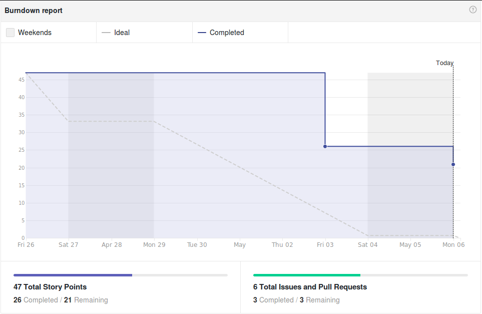
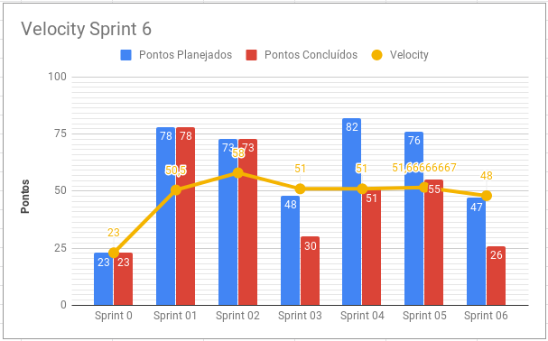
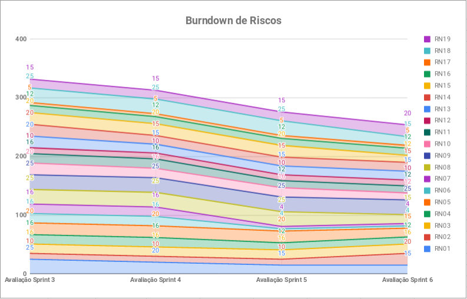
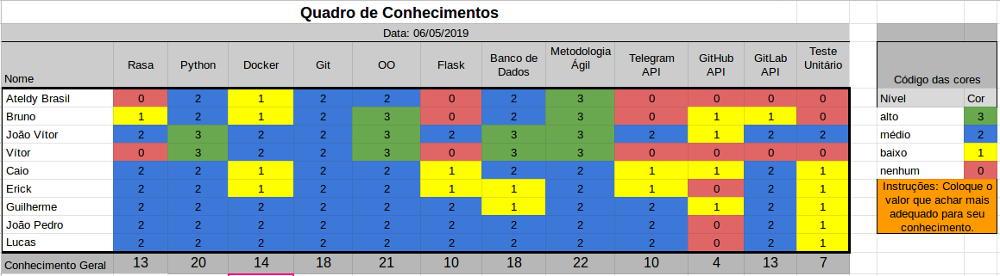

# Resultados Sprint 6

Nessa sprint foi agregada uma US da sprint anterior como dívida, além de adicionar mais quatro issues. Durante essa sprint será feita Release 1.

As tarefas dessa sprint foram relacionadas ao relatório informativo do repositório, criação de issue via ADA, mapeamento do fluxo de conversa e teste em uso.

## Fechamento da Sprint

| Issue | Pontos | Status |
| ----- | ------ | ------ |
| [US16 - Eu, como usuário, desejo que a Ada crie uma issue para mim para reportar algo aos mantenedores do repositório de maneira mais fácil.](https://github.com/fga-eps-mds/2019.1-ADA/issues/156) | 13 | Não Concluída |
| [Criar repositório para serviço do github](https://github.com/fga-eps-mds/2019.1-ADA/issues/157) | 5 | Concluída |
| [Implementar teste em uso](https://github.com/fga-eps-mds/2019.1-ADA/issues/158) | 5 | Não Concluída |
| [Criar mapeamento de conversa entre usuário e bot](https://github.com/fga-eps-mds/2019.1-ADA/issues/155) | 3 | Não Concluída |
| [US30 - Eu, como usuário, desejo receber o relatório informativo de um repositório específico do GitLab.](https://github.com/fga-eps-mds/2019.1-ADA/issues/135) | 21 | Concluída |

__Pontos Planejados :__ 26
__Pontos de Dívida :__ 21

__Pontos Totais Concluídos:__ 26

[Milestone Sprint 6](https://github.com/fga-eps-mds/2019.1-ADA/milestone/7)

## Retrospectiva da Sprint

### Pontos Positivos

* Time trabalhou bastante
* Ótima apresentação apresentação Release 1
* Time engajado 
* Time dedicado para Release 1

### Pontos Negativos

* Erro no Deploy pelo Digital Ocean
* Poucas Histórias entregues
* Cansaço da equipe
* Mau planejamento

### Pontos à Melhorar

* Planejamento
* Comunicação
* Aceitar mais opiniões dos outros
* Não deixar histórias para última hora
* Comentários nos Pull Requests

## Burndown

O gráfico de burndown demonstra a entrega de pontos durante os dias da sprint. 

## Velocity
O velocity é de 48 pontos.

## Burndown de Riscos

 

__Total de pontos de riscos:__ 254

Este burndown de riscos possui uma escala de 0 a 25 para cada risco acontecer, de acordo com a tabela de avaliação presente no [Plano de Gerenciamento de Riscos](https://fga-eps-mds.github.io/2019.1-ADA/#/docs/project/risk_management_plan?id=_53-avalia%c3%a7%c3%a3o-dos-riscos).

A descrição de cada risco se encontra [aqui](https://fga-eps-mds.github.io/2019.1-ADA/#/docs/project/risk_management_plan?id=_4-identifica%c3%a7%c3%a3o-dos-riscos).

## Quadro de Conhecimento

A equipe de EPS elaborou um quadro de conhecimento com tecnologias consideradas essenciais para o desenvolvimento. Com ele é possível ter um overview das capacidades da equipe de desenvolvimento e gerência. 

## Avaliação do Scrum Master

A sprint 6 foi feita durante a preparação e apresentação da Release 1, portanto, foi planejada para ter uma duração maior, dez dias. Apesar disso, os esforços para preparar uma boa apresentação e corrigir falhas, o time acabou não dedicando tanto tempo para concluir as tarefas planejadas, o que ocasionou dívidas. A métrica Targeted Value Increase (TVI+) visto que já não auxilia tanto para análise do time.

_\* O arquiteto Bruno Dantas atuou como DevOps na issue __Criar repositório para serviço do github__._
