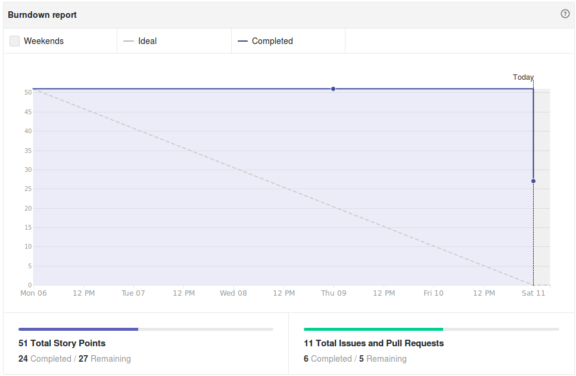
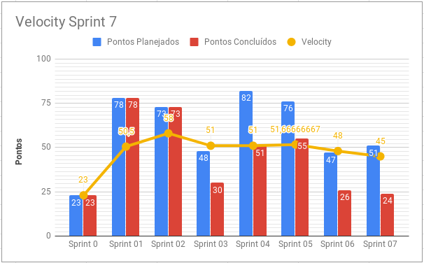
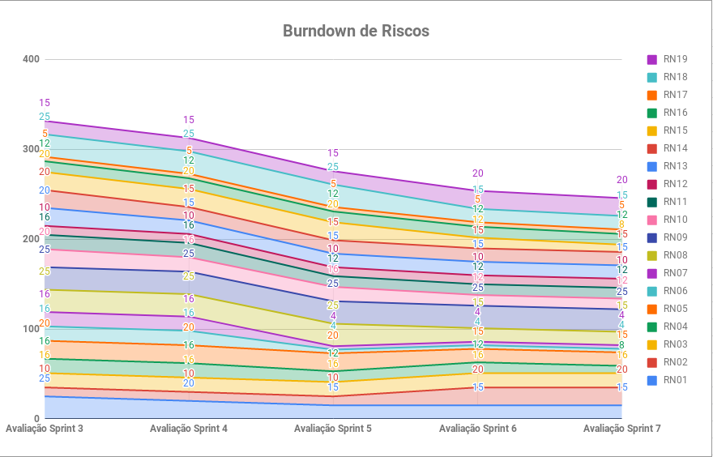
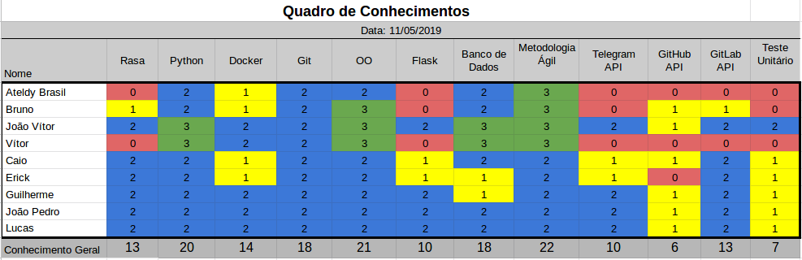

# Resultados Sprint 7

A sprint 7 herdou três tarefas da sprint passada devido à Release 1. Todas as dívidas foram remanejadas para essa sprint que teve como objetivo o cadastro no GitHub e GitLab e a criação de _issue_, além da evolução de artefatos, teste em uso e mapeamento de conversas.

## Fechamento da Sprint

| Issue | Pontos | Status |
| ----- | ------ | ------ |
| [US12 - Eu, como usuário, desejo saber as informações sobre os serviços que a Ada oferece.](https://github.com/fga-eps-mds/2019.1-ada/issues/182) | 3 | Concluída |
| [US06 - Eu, como usuário, desejo que a Ada cadastre meu usuário no GitHub](https://github.com/fga-eps-mds/2019.1-ada/issues/183) | 8 | Não Concluída |
| [Criar cronjob para limpeza de imagens do rancher](https://github.com/fga-eps-mds/2019.1-ada/issues/184) | 3 | Não Concluída |
| [Evoluir Artefatos](https://github.com/fga-eps-mds/2019.1-ada/issues/185) | 3 | Não Concluída |
| [Mudança na forma de cadastrar o usuário com o GitLab a partir da Ada](https://github.com/fga-eps-mds/2019.1-ada/issues/187) | 13 | Não Concluída |
| [US16 - Eu, como usuário, desejo que a Ada crie uma issue para mim para reportar algo aos mantenedores do repositório de maneira mais fácil](https://github.com/fga-eps-mds/2019.1-ada/issues/156) | 13 | Concluída |
| [Implementar teste em uso](https://github.com/fga-eps-mds/2019.1-ada/issues/158) | 5 | Concluída |
| [Criar mapeamento de conversa entre usuário e bot](https://github.com/fga-eps-mds/2019.1-ada/issues/155) | 3 | Concluída |

__Pontos Planejados:__ 30
__Pontos de Dívida:__ 21
__Total:__ 51

> __Pontos Totais Concluídos:__ 24

> [Milestone Sprint 7](https://github.com/fga-eps-mds/2019.1-ADA/milestone/8)

## Retrospectiva da Sprint

### Pontos Positivos

* Fizemos uma ótima apresentação na Release 1
* Ninguém deixou de trabalhar
* Empenho do time
* Pareamentos produtivos

### Pontos Negativos

* Time de EPS tiveram problemas em conciliar com as disciplinas
* Sprint mais curta
* Má comunicação
* Muitas dívidas

### Pontos à Melhorar

* Comunicação
* Comentários em _issue_

## Burndown

O gráfico de burndown demonstra a entrega de pontos durante os dias da sprint. 

## Velocity
O velocity é de 45 pontos.

## Burndown de Riscos

 

__Total de pontos de riscos:__ 246

Este burndown de riscos possui uma escala de 0 a 25 para cada risco acontecer, de acordo com a tabela de avaliação presente no [Plano de Gerenciamento de Riscos](https://fga-eps-mds.github.io/2019.1-ADA/#/docs/project/risk_management_plan?id=_53-avalia%c3%a7%c3%a3o-dos-riscos).

A descrição de cada risco se encontra [aqui](https://fga-eps-mds.github.io/2019.1-ADA/#/docs/project/risk_management_plan?id=_4-identifica%c3%a7%c3%a3o-dos-riscos).

## Quadro de Conhecimento

A equipe de EPS elaborou um quadro de conhecimento com tecnologias consideradas essenciais para o desenvolvimento. Com ele é possível ter um overview das capacidades da equipe de desenvolvimento e gerência. 

## Avaliação do Scrum Master

Devido à duração menor da sprint, má gestão de tempo pela equipe de EPS e dificuldades de implementação de parte do time de desenvolvimento, houveram _27 pontos de dívida_. Apesar disso, foi feito _teste em uso_ e agora é possível cria uma _issue_ através da _ADA_.

_\* O Scrum Master Ateldy atuou como P.O na implementação de __teste em uso__._