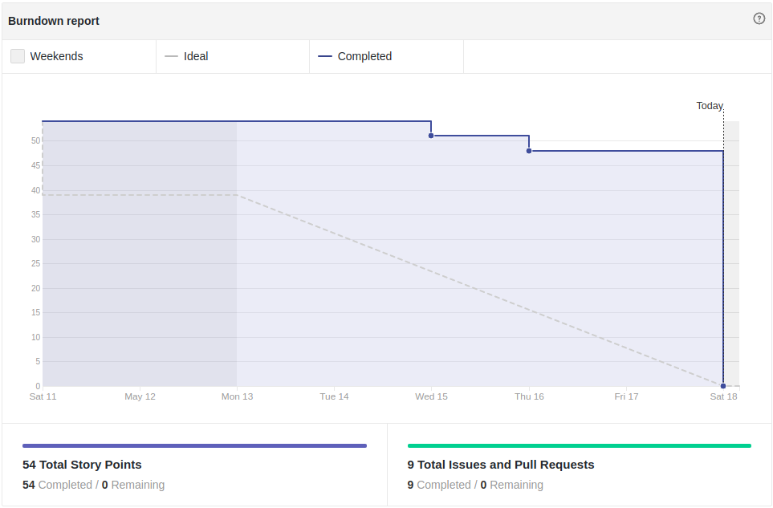
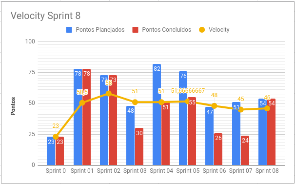
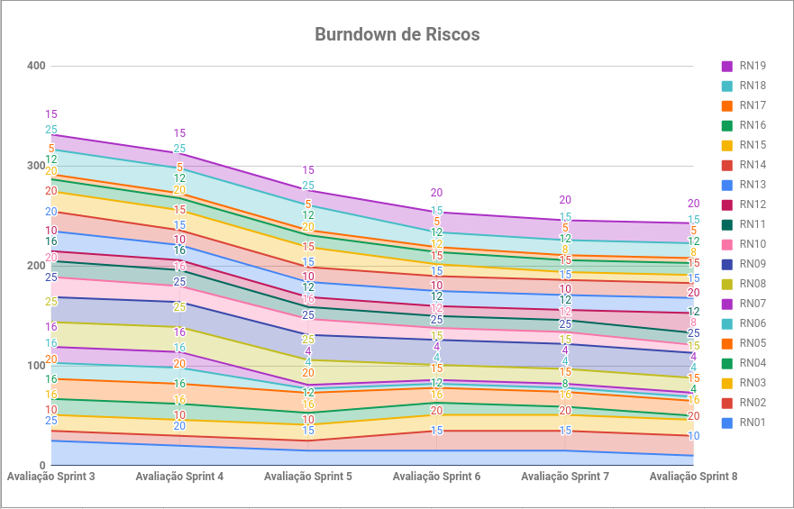
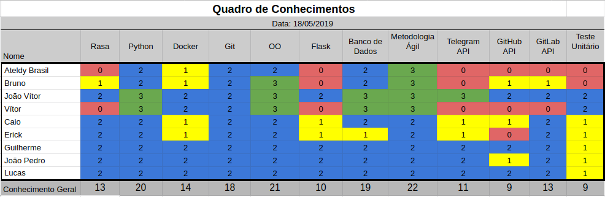

# Resultados Sprint 8

Essa Sprint focada em histórias de dívida da sprint passada, relacionadas à cadastro, reinicialização de build/pipeline e notificações na ADA sobre demora de requisições.

## Fechamento da Sprint

| Issue | Pontos | Status |
| ----- | ------ | ------ |
| [US08 - Eu, como usuário, desejo que a Ada reinicie uma build/pipeline do meu projeto no GitLab CI, caso ela tenha falhado.](https://github.com/fga-eps-mds/2019.1-ADA/issues/194) | 13 | Concluída |
| [Melhora no mapeamento de fluxo de conversas](https://github.com/fga-eps-mds/2019.1-ADA/issues/195) | 3 | Concluída |
| [US14 - Eu, como usuário, desejo ser notificado quando a Ada demorar a recuperar informações para saber o status da minha requisição.](https://github.com/fga-eps-mds/2019.1-ADA/issues/196) | 8 | Concluída |
| [Analisar planejamento e avaliar redução do escopo](https://github.com/fga-eps-mds/2019.1-ADA/issues/200) | 3 | Concluída |
| [US06 - Eu, como usuário, desejo que a Ada cadastre meu usuário no GitHub](https://github.com/fga-eps-mds/2019.1-ADA/issues/183) | 8 | Concluída |
| [Mudança na forma de cadastrar o usuário com o GitLab a partir da Ada](https://github.com/fga-eps-mds/2019.1-ADA/issues/187) | 13 | Concluída |
| [Criar cronjob para limpeza de imagens do rancher](https://github.com/fga-eps-mds/2019.1-ADA/issues/184) | 3 | Concluída |
| [Evoluir Artefatos](https://github.com/fga-eps-mds/2019.1-ADA/issues/185) | 3 | Concluída |

__Pontos Planejados:__ 27
__Pontos de Dívida:__ 27
__Total:__ 54 

> __Pontos Total Concluídos:__ 54

> [Milestone Sprint 8](https://github.com/fga-eps-mds/2019.1-ADA/milestone/9)

## Retrospectiva da Sprint

### Pontos Positivos

* Dívidas resolvidas
* Todas as histórias entregues
* Produtividade
* Equipe motivada
* Escopo reduzido
* Comentários nas issues 

### Pontos Negativos

* Problemas de Saúde
* Falta de comentários nas issues de de P.O.
* Histórias terminadas de última hora

### Pontos à Melhorar

* Comunicação
* Commits mais claros e objetivos

## Burndown

O gráfico de burndown demonstra a entrega de pontos durante os dias da sprint. 

## Velocity
O velocity é de 46 pontos.

## Burndown de Riscos

 

__Total de pontos de riscos:__ 243*

Este burndown de riscos possui uma escala de 0 a 25 para cada risco acontecer, de acordo com a tabela de avaliação presente no [Plano de Gerenciamento de Riscos](https://fga-eps-mds.github.io/2019.1-ADA/#/docs/project/risk_management_plan?id=_53-avalia%c3%a7%c3%a3o-dos-riscos).

A descrição de cada risco se encontra [aqui](https://fga-eps-mds.github.io/2019.1-ADA/#/docs/project/risk_management_plan?id=_4-identifica%c3%a7%c3%a3o-dos-riscos).

## Quadro de Conhecimento

A equipe de EPS elaborou um quadro de conhecimento com tecnologias consideradas essenciais para o desenvolvimento. Com ele é possível ter um overview das capacidades da equipe de desenvolvimento e gerência. 

## Avaliação do Scrum Master

Essa sprint obteve um grande êxito em relação à conclusão de histórias. Todas as tarefas planejadas foram concluídas, diferente das duas últimas sprints.

Ainda há problemas para a entrega de histórias de última hora, o que interfere nas avaliações de _Pull Requests_ pelo time de _EPS_.

Foi cobrado mais comunicação nas _dailies meetings_, com mais detalhamento sobre o que foi e o que será feito por cada membro do time, pois foi notado uma falta de alinhamento da equipe. 

_\* Riscos relacionados ao __projeto não atender os requisitos__, __adaptação à tecnologias escolhidas__ e __histórias de usuário mal definidas__ foram diminuídos. Já o relacionado à __mudança de escopo aumentou__, já que a redução foi requerida pela professora Carla Rocha._  
