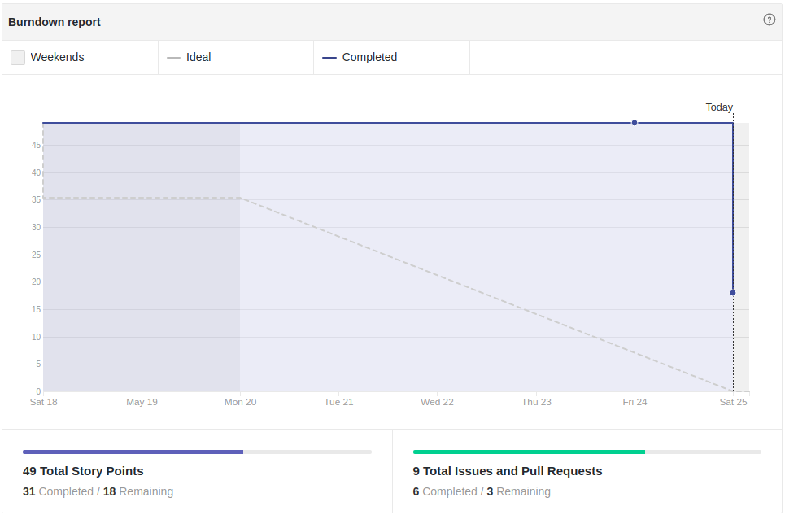
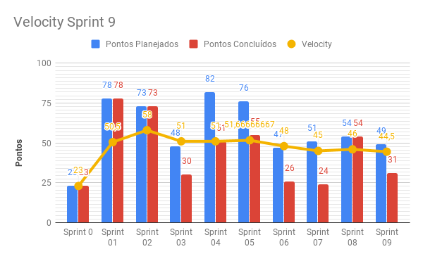
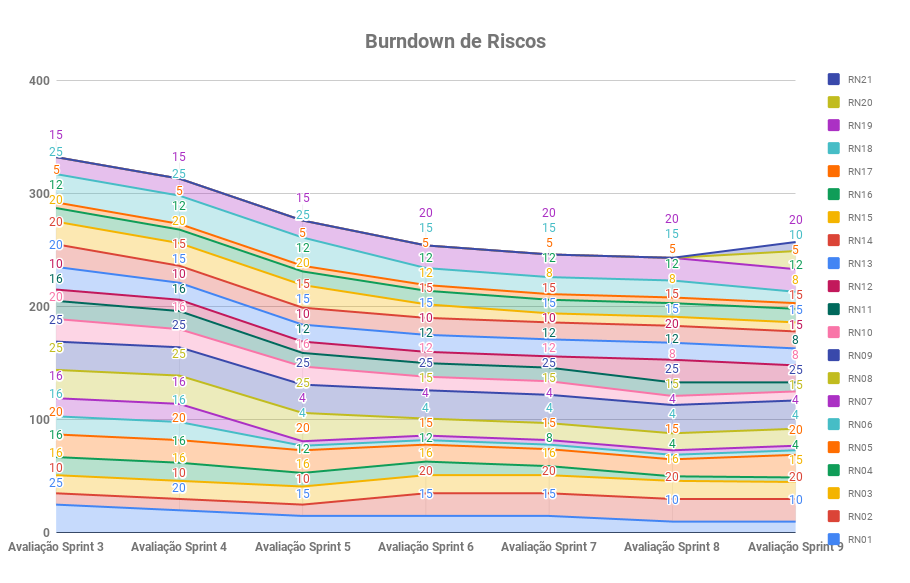
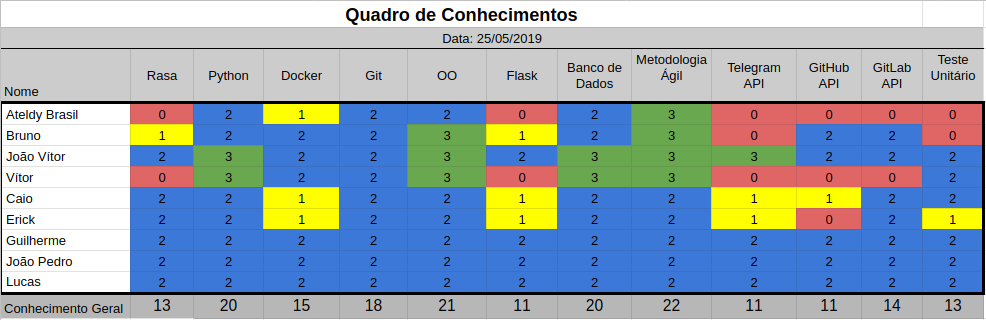

# Resultados Sprint 9

Essa Sprint foi focada na melhoria de código, com três tarefas relacionadas à refatoração, além de histórias relacionadas ao Deploy de uma versão estável do repositório do usuário e um relatório informativo do Github.

## Fechamento da Sprint

| Issue | Pontos | Status |
| ----- | ------ | ------ |
| [US24 - Eu, como usuário, desejo que a Ada configure no pipeline de deploy a última versão estável do repositório para recolocar o serviço no ar.](https://github.com/fga-eps-mds/2019.1-ADA/issues/213)  | 5 | Concluída |
| [US28 - Eu, como usuário, desejo receber um relatório informativo de um repositório cadastrado do GitHub](https://github.com/fga-eps-mds/2019.1-ADA/issues/212) | 8 | Concluída |
| [Implementar banco GitHub](https://github.com/fga-eps-mds/2019.1-ADA/issues/208) | 5 |  Concluída |
| [Refatoração repositório Ada Github](https://github.com/fga-eps-mds/2019.1-ADA/issues/211) | 5 | Não Concluída |
| [Refatoração repositório AdaBot](https://github.com/fga-eps-mds/2019.1-ADA/issues/210) | 5 | Concluída |
| [Refatoração repositório Ada Gitlab](https://github.com/fga-eps-mds/2019.1-ADA/issues/209) | 8 | Não Concluída |
| [Criar webhook GitHub](https://github.com/fga-eps-mds/2019.1-ADA/issues/218) | 5 | Não Concluída |
| [Criar EVM](https://github.com/fga-eps-mds/2019.1-ADA/issues/215) | 8 | Concluída |

__Pontos Planejados:__ 49

__Pontos de Dívida:__ 0

__Total:__  49 

> __Pontos Total Concluídos:__ 31

> [Milestone Sprint 9](https://github.com/fga-eps-mds/2019.1-ADA/milestone/10)

## Retrospectiva da Sprint

### Pontos Positivos

* Pareamento proativo
* Equipe se ajudando
* Equipe engajada 

### Pontos Negativos

* Organização da equipe no Sprint Review
* Negligenciamento dos testes pelo time de desenvolvimento
* Equipe em semana de provas
* Sobrecarga do DevOps

### Pontos à Melhorar

* Entregar histórias antes do dia da Sprint Review
* Fazer testes
* Comunicação
* Deixar mais claro as priorizações das histórias

## Burndown

O gráfico de burndown demonstra a entrega de pontos durante os dias da sprint. 

## Velocity
O velocity é de 44,5 pontos.

## Burndown de Riscos

 

__Total de pontos de riscos:__ 257*

Este burndown de riscos possui uma escala de 0 a 25 para cada risco acontecer, de acordo com a tabela de avaliação presente no [Plano de Gerenciamento de Riscos](https://fga-eps-mds.github.io/2019.1-ADA/#/docs/project/risk_management_plan?id=_53-avalia%c3%a7%c3%a3o-dos-riscos).

A descrição de cada risco se encontra [aqui](https://fga-eps-mds.github.io/2019.1-ADA/#/docs/project/risk_management_plan?id=_4-identifica%c3%a7%c3%a3o-dos-riscos).

## Quadro de Conhecimento

A equipe de EPS elaborou um quadro de conhecimento com tecnologias consideradas essenciais para o desenvolvimento. Com ele é possível ter um overview das capacidades da equipe de desenvolvimento e gerência. 

A escala vai de 0 a 3, onde 0 é nenhum conhecimento e 3 é alto conhecimento.

## Cobertura de Testes

### Repositório ADA GitHub

### Repositório ADA GitLab

## Avaliação do Scrum Master

Nessa sprint, cerca de dois terços dos pontos planejados foram entregues. As histórias de [Refatoração repositório Ada Github](https://github.com/fga-eps-mds/2019.1-ADA/issues/211) e [Refatoração repositório Ada Gitlab](https://github.com/fga-eps-mds/2019.1-ADA/issues/209) houveram avanços, mas não foram concluídas completamente, conforme as _tasks_ definidas. Já a história de criação de [Criar webhook GitHub](https://github.com/fga-eps-mds/2019.1-ADA/issues/218) de grande importância para histórias futuras, não foi iniciada. Nessa história, o P.O. percebeu um erro em comunicar sua prioridade. 

Ainda há problemas para a entrega de histórias de última hora, principalmente por causa da negligencia de testes, o que interfere nas avaliações de _Pull Requests_ pelo time de _EPS_. O Burndown da sprint demonstra isto.

_\* Riscos relacionados à __arquitetura__, __adaptação à tecnologias escolhidas__, __Sprint mal planejada__, __mudança de escopo__ e __qualidade do software não atender às expectativas do cliente__ foram diminuídos. Já o relacionado à __dificuldades em realizar os testes__, foi aumentada, pois o time de desenvolvimento relatou problemas em relação à testes. Em conversa com o time de EPS, foi sugerido a adição de mais dois riscos no _Burndown de riscos_, um risco relacionado à __problemas de saúde de algum membro__ e outro à __desintendimento entre os membros__._

_\*\* O Scrum Master Ateldy atuou como __P.O.__ na __criação da EVM__.
O arquiteto Bruno Dantas e o DevOps João Vítor atuaram como __desenvolvedores__ na __refatoração do repositório AdaBot__._